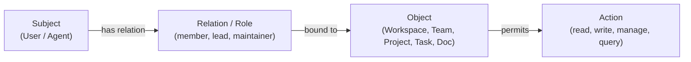

# Authorization & Permissions Low-Level Design (LLD)

## 1. Document Overview & Context

This document is the **Low-Level Design (LLD)** for the **Authorization, Permissions, and Pre-Retrieval Access Control** subsystem of **Company Brain**. It builds directly upon the High-Level Design in [`docs/architecture/overview.md`](file:///F:/Projects/Fabric/docs/architecture/overview.md), the repository operating manual in [`AGENTS.md`](file:///F:/Projects/Fabric/AGENTS.md), the relational persistence layer in [`docs/architecture/database.md`](file:///F:/Projects/Fabric/docs/architecture/database.md), and the identity architecture in [`docs/architecture/identity.md`](file:///F:/Projects/Fabric/docs/architecture/identity.md).

Company Brain is explicitly **team-first rather than enterprise-only**. It serves collaborative groups across the spectrum:
- Startups and growth-stage companies
- College and hackathon engineering teams
- Open-source communities
- Research laboratories
- Multi-team enterprises

The core product hierarchy established in Phase 1 is:
```text
Workspace
    │
    ├── Users
    ├── Teams
    └── Projects
           │
           ├── Members
           └── Tasks
```

In Company Brain, organizational knowledge is synthesized from external activity (GitHub, Google Workspace, Microsoft 365, Slack) into a unified, temporal property graph and semantic vector index. 

This requires an authorization model that operates across three distinct operational planes:
1. **Relational Plane**: Standard CRUD operations on Workspaces, Users, Teams, Projects, and Tasks.
2. **Retrieval Plane**: Pre-filtering vector embeddings, semantic chunks, and graph neighborhoods *before* unprivileged content can reach an LLM prompt.
3. **Agent & MCP Plane**: Enforcing identical access constraints on background AI workflows and Model Context Protocol (MCP) tool executions.

```text
┌────────────────────────────────────────────────────────────────────────┐
│                        AUTHORIZATION SUBSYSTEM                         │
├────────────────────────────────────────────────────────────────────────┤
│ 1. Tenancy Guard         Enforces strict Workspace isolation           │
├────────────────────────────────────────────────────────────────────────┤
│ 2. Relational Policy     Evaluates Workspace roles & Project/Team ReBAC│
├────────────────────────────────────────────────────────────────────────┤
│ 3. Pre-Retrieval Filter  Prunes Vector DB & Graph search BEFORE prompt │
├────────────────────────────────────────────────────────────────────────┤
│ 4. Interface Parity      Ensures REST API, MCP tools, & Agents share   │
│                          the exact same deterministic enforcement      │
└────────────────────────────────────────────────────────────────────────┘
```

> [!IMPORTANT]
> **Design-First Invariant**: This document is an architectural design and specification. **No authorization code, policy engines, API middleware, ORM models, or database migrations will be written in this phase.**

---

## 2. Core Authorization Principles & Architectural Invariants

Every component of Company Brain must respect these architectural invariants:

1. **Deterministic Security Boundary (Zero LLM Trust)**:
   - LLMs interpret language, synthesize summaries, and propose actions; **deterministic software validates and decides permissions**.
   - The LLM must **never** be the authoritative decision-maker for authorization.
   - **Prompt-Based Authorization is Strictly Prohibited**: We will never retrieve unauthorized records with the expectation that system prompts or LLM guardrails will conceal them from the user.
2. **Authorization Before Retrieval (Pre-Retrieval Filtering & Traversal Safety)**:
   - Access control evaluation must occur **before** data is fetched, traversed, or compiled into context.
   - The retrieval engine deterministically prunes unauthorized nodes, edges, documents, and vector chunks before prompt construction.
   - **Graph Traversal Safety Invariant**: Every node and relationship traversed or returned by a user-facing graph retrieval operation must be within the authenticated user's authorized scope, unless it is explicitly classified as workspace-global/public by the authorization model.
   - **Endpoint-Derived Relationship Authorization (Option A Adopted)**: In V1, relationships do not carry independent visibility or separate ACLs. A relationship is traversable and returnable if and only if:
     1. It belongs to the authenticated workspace (`rel.workspace_id == $workspace_id`),
     2. Both endpoint nodes are within the authenticated user's authorized scope, and
     3. The relationship type is explicitly allowed for user-facing traversal (`type(rel) IN $allowed_relationship_types`).
     An unauthorized private or project-scoped node must never serve as an intermediate traversal hop merely because the final target node is authorized.
3. **Strict Workspace Tenancy Boundary**:
   - The `Workspace` is the absolute tenant boundary.
   - All authorization checks require a verified `workspace_id`.
   - Cross-workspace permission inheritance, global role leakage, or multi-tenant graph traversals are physically prohibited.
4. **Least Privilege & Default Deny**:
   - Every operation defaults to `DENY`.
   - Access is granted only when an explicit role, direct membership, or transitive team relationship proves permission.
   - **Explicit Scoping Invariant**: A resource having `project_id == NULL` is strictly **NOT** sufficient evidence of readability. NULL `project_id` alone does not grant access.
5. **Full MCP & Agent Parity**:
   - Model Context Protocol (MCP) tools and AI background agents must execute through the exact same application services and authorization checks as the primary REST API.
   - There are zero backdoors, bypass modes, or elevated "god-mode" shortcuts for AI agents.
6. **Multi-Role Contextuality (Team-First ReBAC)**:
   - Permissions derive from relationships:
     - Workspace role (`owner`, `admin`, `member`, `guest`)
     - Team membership and team role (`lead`, `member`, `contributor`)
     - Project membership and project role (`lead`, `maintainer`, `contributor`, `viewer`)
     - Team ownership of projects
     - Project visibility (`workspace` vs `private`)
7. **Temporal Authorization Awareness**:
   - As team memberships change, authorization dynamically reflects current state. Historical evidence remains intact, but query visibility reflects the user's active permissions.
8. **Low Latency Performance Targets & Design Budgets**:
   - **Target Performance Objectives**:
     - Single-resource authorization check budget: `< 5ms` target.
     - Bulk retrieval scope compilation budget (e.g., computing all accessible `project_ids` for a user): `< 15ms` target.
   - **Validation Requirement**: These latency figures are architectural performance targets and engineering design budgets rather than guaranteed benchmark facts. They must be formally measured and validated through reproducible benchmarks under defined production-representative workloads (e.g., across varying workspace sizes, project counts, and team hierarchies) before production claims are made.

---

## 3. Core Concepts: Subjects, Objects, and Relations

Company Brain utilizes a **hybrid RBAC + ReBAC model** inspired by Google Zanzibar. Access decisions are evaluated against relationship tuples:

$$\text{Can } \langle\text{Subject}\rangle \text{ perform } \langle\text{Action}\rangle \text{ on } \langle\text{Object}\rangle\text{?}$$



### 3.1 Subjects

| Subject Type | Format / Representation | Description |
| :--- | :--- | :--- |
| **User Subject** | `User:<uuidv7>` | An authenticated human user within a specific Workspace. Carries `(user_id, workspace_id, workspace_role)`. |
| **Agent / Service Subject** | `Agent:<uuidv7>` | An AI assistant acting on behalf of a specific user. Operates strictly under the user's delegated identity context. |
| **Subject Set** | `Team:<team_id>#member` | All members belonging to a specific Team. Used for transitive project permissions. |
| **System Subject** | `System:Internal` | Internal worker background jobs (ingestion, compilation) operating on low-level pipelines with no user-facing query bypass. |

### 3.2 Objects (Resources) & Conceptual Scopes

All objects belong strictly to a single `Workspace`. To prevent unauthorized access and eliminate ambiguity around unscoped resources, every entity, document, and graph node belongs to an explicit **conceptual scope**:

```text
Objects in Hierarchy & Conceptual Scopes
├── Workspace:<workspace_id>
│    ├── [workspace/global scope] (visibility = 'workspace', readable by non-guest members)
│    ├── [internal/system scope]  (visibility = 'internal', worker/system only; NEVER exposed to user search)
│    ├── User:<user_id>
│    ├── Team:<team_id>
│    └── Project:<project_id>     [project scope] (governed by project permissions)
│           ├── Task:<task_id>
│           ├── Document:<document_id>
│           └── KnowledgeNode:<node_urn>
```

#### Explicit Rule: `project_id == NULL` Never Implies Public Readability
- A resource having `project_id IS NULL` is **NOT** automatically public or accessible.
- An unscoped or workspace-level resource is accessible if and only if:
  1. It is explicitly classified with `visibility = 'workspace'` (or equivalent workspace-global scope), AND
  2. The requesting user has a non-guest workspace role (`workspace_role != 'guest'`).
- Any record where `project_id IS NULL` that lacks an explicit `visibility = 'workspace'` classification (e.g., unclassified, `internal`, or `private`) defaults strictly to **`DENY`**.

### 3.3 Relations & Contextual Roles

From Phase 1 relational database models ([`database.md`](file:///F:/Projects/Fabric/docs/architecture/database.md)):

1. **Workspace Roles**:
   - `owner`: Creator or co-owner. Absolute administrative authority over workspace settings, billing, users, and all projects.
   - `admin`: Operational administrator. Manages users, teams, projects, integrations. Cannot delete the workspace or demote owners.
   - `member`: Standard collaborator. Full read access to all workspace-visible projects; can create projects and teams.
   - `guest`: Restricted external participant (contractor, student, client). **Zero default access to workspace-visible projects**; can only access projects where explicitly added as a `ProjectMember`.
2. **Team Roles**:
   - `lead`: Coordinates team, manages team members, manages team-owned projects.
   - `member`: Standard team member. Automatically inherits permissions on team-owned projects.
   - `contributor`: Affiliated collaborator on the team.
     - **Team Contributor Inheritance Policy**: A Team `contributor` does **NOT** automatically inherit access to private team-owned projects. Private project access for a team contributor requires an explicit `ProjectMember` record on the project.
3. **Project Roles**:
   - `lead`: Project director / product lead. Manages project settings, members, tasks, and deletion.
   - `maintainer`: Core contributor. Manages tasks, writes documentation, merges decisions.
   - `contributor`: Standard contributor. Creates and completes assigned tasks, edits docs.
   - `viewer`: Read-only observer. Can view project history, graph context, and tasks; cannot mutate state.
4. **Project Visibility**:
   - `workspace`: Readable by all non-guest Workspace members.
   - `private`: Restricted strictly to explicit `ProjectMember` records and members of the owning `Team`.

---

## 4. The Hybrid RBAC + ReBAC Model

### 4.1 Why Flat RBAC Fails for Team Intelligence

A purely hierarchical Role-Based Access Control (RBAC) model (e.g. `User is ADMIN`) breaks down in modern collaborative teams:
1. **Matrix Collaboration**: An engineer is a `member` of the Backend Team, but a `lead` on a Cross-Functional AI Project, and a `viewer` on a Secret Security Audit Project.
2. **Team-Owned Projects**: Projects are frequently assigned to teams (`projects.team_id = teams.id`). When a developer joins the "Platform Team", they should automatically inherit access to all Platform-owned projects without individual per-project invitations.
3. **Guest Confinement**: Hackathon teams, clients, and student interns often join as `guest`. They must not browse other projects in the Workspace unless explicitly granted a project-level seat.
4. **Granular Graph & Vector Search**: When a user queries "What were our Q3 roadmap decisions?", the search engine cannot simply check `user.role == 'member'`. It must filter out decisions linked to private projects the user does not have permission to view.

### 4.2 ReBAC Relationship Graph

To resolve access, Company Brain evaluates a directed relationship graph:

```mermaid
graph TD
    subgraph "Workspace Tenancy Boundary"
        W["Workspace: Stanford Robotics"]
        
        U1["User: Alex (member)"]
        U2["User: Guest Student (guest)"]
        
        T1["Team: SLAM Squad"]
        
        P1["Project: Sensor Calibration<br/>(visibility: workspace)"]
        P2["Project: Secret Patent<br/>(visibility: private, team: SLAM Squad)"]
        P3["Project: Student Lab<br/>(visibility: private)"]
        
        TK1["Task: Calibrate LiDAR"]
        DOC1["Document: Patent Draft"]
    end

    W -->|contains| U1
    W -->|contains| U2
    W -->|contains| T1
    W -->|contains| P1
    W -->|contains| P2
    W -->|contains| P3

    U1 -->|member_of| T1
    T1 -->|owns| P2
    P2 -->|contains| DOC1
    P1 -->|contains| TK1

    U2 -->|explicit_member (viewer)| P3
```

### 4.3 Permission Derivation Rules

The authorization engine resolves access through deterministic derivation rules:

```text
Rule 1: Workspace Administrative Superuser
  User is Workspace OWNER or ADMIN
  ⟹ User has FULL administrative & read access to ALL Projects, Teams, Tasks, and Docs in Workspace.

Rule 2: Workspace-Visible Project Read
  Project.visibility == 'workspace'
  AND User.workspace_role IN ('owner', 'admin', 'member')
  ⟹ User can READ Project, its Tasks, and its public Graph/Vector Context.

Rule 3: Guest Project Confinement
  User.workspace_role == 'guest'
  ⟹ User can ONLY access Projects where an explicit ProjectMember(user_id, project_id) exists,
     regardless of Project.visibility.

Rule 4: Team-Owned Private Project Inheritance
  Project.visibility == 'private'
  AND Project.team_id IS NOT NULL
  AND User is TeamMember of Project.team_id (role IN ('lead', 'member'))
  ⟹ User can READ Project and inherits base contributor access.

  IMPORTANT POLICY INVARIANT:
  A User with Team role 'contributor' does NOT automatically inherit access to private team-owned projects.
  Team contributors require an explicit ProjectMember record to access any private project.

Rule 5: Explicit Project Membership Override
  Explicit ProjectMember(user_id, project_id) exists
  ⟹ User receives the explicit project_role (lead, maintainer, contributor, viewer).
  This overrides team-level defaults and grants guest access.

Rule 6: Task Permission Inheritance
  Task inherits read/write access from its parent Project.
  User can READ Task ⟺ User can READ parent Project.
  User can UPDATE Task ⟺ User can CONTRIBUTE to parent Project OR User == Task.assignee.
```

---

## 5. Formal Permission Matrix & Operation Specifications

### 5.1 Canonical Actions

Actions are formatted as `<domain>:<action>`:

```text
Actions Namespace
├── workspace:*   (read, update, manage_members, delete, invite)
├── team:*        (read, create, update, manage_members, delete)
├── project:*     (read, create, update, manage_members, delete, archive, invite)
├── task:*        (read, create, update, assign, delete)
└── knowledge:*   (query_graph, search_vector, read_evidence, export)
```

### 5.2 Workspace Operations Matrix

| Operation | Description | Owner | Admin | Member | Guest |
| :--- | :--- | :---: | :---: | :---: | :---: |
| `workspace:read` | View workspace metadata, stats, and member list | **YES** | **YES** | **YES** | Restricted* |
| `workspace:update` | Edit workspace name, settings, avatar | **YES** | **YES** | NO | NO |
| `workspace:manage_members` | Change workspace roles, suspend/deactivate users | **YES** | **YES** | NO | NO |
| `workspace:delete` | Soft-delete / offboard the entire workspace | **YES** | NO | NO | NO |
| `workspace:invite` | Invite new users to the workspace | **YES** | **YES** | **YES** | NO |

*\*Guest view of workspace members is restricted to co-members in shared projects.*

### 5.3 Team Operations Matrix

| Operation | Description | Workspace Admin/Owner | Team Lead | Team Member | Non-Team Member |
| :--- | :--- | :---: | :---: | :---: | :---: |
| `team:read` | View team profile, members, and owned projects | **YES** | **YES** | **YES** | **YES** (if non-guest) |
| `team:create` | Create a new team within the workspace | **YES** | — | **YES** | **YES** (if non-guest) |
| `team:update` | Update team name, description, avatar | **YES** | **YES** | NO | NO |
| `team:manage_members` | Add/remove users and change team roles | **YES** | **YES** | NO | NO |
| `team:delete` | Soft-delete team | **YES** | **YES** | NO | NO |

### 5.4 Project Operations Matrix

| Operation | Description | Workspace Admin/Owner | Project Lead | Project Maintainer | Project Contributor | Project Viewer | Non-Member (Workspace Visible) | Non-Member (Private) |
| :--- | :--- | :---: | :---: | :---: | :---: | :---: | :---: | :---: |
| `project:read` | View project details, timeline, tasks, docs | **YES** | **YES** | **YES** | **YES** | **YES** | **YES** | **DENY** |
| `project:update` | Edit project metadata, visibility, settings | **YES** | **YES** | NO | NO | NO | NO | **DENY** |
| `project:manage_members`| Add/remove project members, assign roles | **YES** | **YES** | NO | NO | NO | NO | **DENY** |
| `project:delete` | Soft-delete project | **YES** | **YES** | NO | NO | NO | NO | **DENY** |
| `project:archive` | Transition project status to `archived` | **YES** | **YES** | **YES** | NO | NO | NO | **DENY** |
| `project:invite` | Issue a `ProjectInvite` token | **YES** | **YES** | **YES** | NO | NO | NO | **DENY** |

> [!NOTE]
> **Team Contributor Inheritance Policy on Private Projects**:
> For private projects (`visibility = 'private'`), members of the owning team with role `lead` or `member` inherit read and contributor access. Users with team role `contributor` do **NOT** inherit access to private team-owned projects; their access evaluates to **DENY** unless they possess an explicit `ProjectMember` record on the project.

### 5.5 Task Operations Matrix

| Operation | Description | Project Lead/Maintainer | Task Creator | Task Assignee | Project Contributor | Project Viewer |
| :--- | :--- | :---: | :---: | :---: | :---: | :---: |
| `task:read` | View task details, comments, subtasks | **YES** | **YES** | **YES** | **YES** | **YES** |
| `task:create` | Create a task in the project | **YES** | **YES** | **YES** | **YES** | NO |
| `task:update` | Edit task title, description, status | **YES** | **YES** | **YES** | **YES** | NO |
| `task:assign` | Assign or reassign task to a user | **YES** | **YES** | **YES** | NO | NO |
| `task:delete` | Soft-delete task | **YES** | **YES** | NO | NO | NO |

### 5.6 Knowledge & Evidence Operations Matrix

| Operation | Description | Scope Required |
| :--- | :--- | :--- |
| `knowledge:query_graph` | Execute natural language or Cypher queries over Knowledge Graph | Permitted over subgraph restricted to `AccessibleProjects(User)` |
| `knowledge:search_vector`| Execute semantic search over vector embeddings | Permitted over chunks restricted to `AccessibleProjects(User)` |
| `knowledge:read_evidence`| Retrieve raw source payload (commit diff, raw chat message, document revision) | Permitted if user has read access to the originating Project/Source |
| `knowledge:view_provenance`| View audit trail of who created an entity or extracted a fact | Permitted for all nodes visible to the user |

---

## 6. Pre-Retrieval Authorization Architecture (The Retrieval Filter)

### 6.1 The Critical Architectural Dilemma

Most RAG (Retrieval-Augmented Generation) architectures fail authorization because they employ **post-retrieval filtering** or **prompt-level hiding**:

```text
FLAWED POST-RETRIEVAL ARCHITECTURE (DO NOT USE)
User Query ──► Vector Search (Unfiltered) ──► Top 20 Chunks (Includes Private Docs!)
                                                      │
                                                      ▼
                                           LLM Prompt: "Ignore chunk 3 if secret"
                                                      │
                                                      ▼
                                           LEAKAGE / PROMPT INJECTION VULNERABILITY!
```

In accordance with [`AGENTS.md` Invariant 5 (Authorization Before Retrieval)](file:///F:/Projects/Fabric/AGENTS.md):
> **Authorization filtering must occur BEFORE unauthorized information reaches an LLM prompt.**
> We must never retrieve an unfiltered context window and attempt to instruct the LLM to hide unauthorized information.

### 6.2 Pre-Retrieval Filter Pipeline

Company Brain implements **Deterministic Pre-Retrieval Filtering**:

```text
                      User Query + Authenticated IdentityContext
                                          │
                                          ▼
┌────────────────────────────────────────────────────────────────────────┐
│              STEP 1: Accessible Scope Compilation                      │
│                                                                        │
│  Given: (user_id, workspace_id, workspace_role)                        │
│  Computes:                                                             │
│    - accessible_project_ids: Set[UUID]                                 │
│    - can_access_workspace_public: Boolean                              │
│  Execution: Single indexed SQL CTE query (< 10ms target budget)        │
└───────────────────────────────────┬────────────────────────────────────┘
                                    │
                                    ├────────────────────────────────────┐
                                    ▼                                    ▼
┌──────────────────────────────────────────────┐ ┌──────────────────────────────────────────────┐
│     STEP 2A: Vector Index Pre-Filtering      │ │    STEP 2B: Knowledge Graph Pre-Filtering    │
│                                              │ │                                              │
│  PostgreSQL / pgvector query contains hard   │ │  Cypher traversal constrains EVERY node &    │
│  WHERE clause matching accessible scope:     │ │  relationship on the path (Option A):        │
│                                              │ │                                              │
│  WHERE workspace_id = :ws_id                 │ │  WHERE ALL(n IN nodes(path) WHERE            │
│    AND (                                     │ │    n.workspace_id = $ws_id AND (             │
│      (project_id IS NOT NULL AND             │ │      (n.project_id IS NOT NULL AND           │
│       project_id = ANY(:accessible_pids))    │ │       n.project_id IN $accessible_pids)      │
│      OR (visibility = 'workspace' AND        │ │      OR (n.visibility = 'workspace' AND      │
│          :is_not_guest = TRUE)               │ │          $is_not_guest = true)               │
│    )                                         │ │    )                                         │
│  (NULL project_id alone NEVER grants access) │ │  )                                           │
│                                              │ │  AND ALL(rel IN relationships(path) WHERE    │
│                                              │ │    rel.workspace_id = $ws_id AND             │
│                                              │ │    type(rel) IN $allowed_rel_types)          │
└──────────────────────┬───────────────────────┘ └──────────────────────┬───────────────────────┘
                       │                                                │
                       └───────────────────────┬────────────────────────┘
                                               │
                                               ▼
┌────────────────────────────────────────────────────────────────────────┐
│                 STEP 3: Context Assembly & Redaction                   │
│                                                                        │
│  - Merges authorized graph facts & vector snippets                     │
│  - Deterministically redacts restricted property fields                │
│  - Appends verifiable evidence IDs                                     │
└──────────────────────────────────────┬─────────────────────────────────┘
                                       │
                                       ▼
┌────────────────────────────────────────────────────────────────────────┐
│                 STEP 4: LLM Synthesis & Tool Response                  │
│                                                                        │
│  The authorization architecture prevents unauthorized data from        │
│  entering the LLM context through the authorized retrieval pipeline by │
│  enforcing deterministic pre-retrieval filtering before context        │
│  assembly.                                                             │
└────────────────────────────────────────────────────────────────────────┘
```

### 6.3 Algorithmic Specification: `AccessibleScope` Query

The `AccessibleScope` query deterministically resolves all accessible `project_ids` for a user within their workspace using a single PostgreSQL Common Table Expression (CTE):

```sql
WITH user_context AS (
    SELECT id, workspace_id, workspace_role, status
    FROM users
    WHERE id = :user_id 
      AND workspace_id = :workspace_id 
      AND deleted_at IS NULL
),
direct_project_grants AS (
    -- Projects where the user is an explicit ProjectMember
    SELECT pm.project_id
    FROM project_members pm
    JOIN user_context uc ON uc.id = pm.user_id AND uc.workspace_id = pm.workspace_id
    WHERE pm.deleted_at IS NULL
),
team_project_grants AS (
    -- Projects owned by teams where the user is a team lead or member (NOT contributor)
    SELECT p.id AS project_id
    FROM projects p
    JOIN team_members tm ON tm.team_id = p.team_id AND tm.workspace_id = p.workspace_id
    JOIN user_context uc ON uc.id = tm.user_id AND uc.workspace_id = tm.workspace_id
    WHERE p.deleted_at IS NULL 
      AND tm.deleted_at IS NULL
      AND tm.team_role IN ('lead', 'member') -- Team 'contributor' excluded by design
),
workspace_public_projects AS (
    -- All workspace-visible projects (EXCLUDED if user is a guest)
    SELECT p.id AS project_id
    FROM projects p
    JOIN user_context uc ON uc.workspace_id = p.workspace_id
    WHERE p.visibility = 'workspace'
      AND p.deleted_at IS NULL
      AND uc.workspace_role != 'guest'
),
admin_all_projects AS (
    -- Owners and Admins can see all projects in the workspace
    SELECT p.id AS project_id
    FROM projects p
    JOIN user_context uc ON uc.workspace_id = p.workspace_id
    WHERE uc.workspace_role IN ('owner', 'admin')
      AND p.deleted_at IS NULL
)
SELECT DISTINCT project_id 
FROM (
    SELECT project_id FROM direct_project_grants
    UNION ALL
    SELECT project_id FROM team_project_grants
    UNION ALL
    SELECT project_id FROM workspace_public_projects
    UNION ALL
    SELECT project_id FROM admin_all_projects
) authorized_projects;
```

#### Properties of this Scope Query:
1. **Fully Indexed**: Utilizes composite indexes created in Phase 1:
   - `idx_project_members_lookup ON project_members(workspace_id, project_id, user_id)`
   - `idx_team_members_lookup ON team_members(workspace_id, team_id, user_id)`
   - `idx_projects_lookup ON projects(workspace_id, team_id, lead_user_id)`
2. **Target Execution Objective**: Designed as an indexed, set-based query with a target execution budget of `< 5ms` under standard operational workloads. Actual latencies must be validated through load benchmarking under defined multi-tenant dataset sizes before production claims are made.
3. **Guest Proof**: If `workspace_role == 'guest'`, `workspace_public_projects` and `admin_all_projects` return zero rows; only `direct_project_grants` are returned.

### 6.4 Vector Index Pre-Filtering Implementation

When searching vector embeddings (e.g. pgvector `vector_chunks`):

```sql
SELECT 
    vc.id,
    vc.document_id,
    vc.project_id,
    vc.content,
    vc.embedding <=> :query_embedding AS distance
FROM vector_chunks vc
WHERE vc.workspace_id = :workspace_id
  AND vc.deleted_at IS NULL
  AND (
      -- 1. Project-scoped resource: must belong to user's accessible projects
      (vc.project_id IS NOT NULL AND vc.project_id = ANY(:accessible_project_ids))
      OR
      -- 2. Workspace-global resource: must carry explicit workspace visibility (NULL project_id alone does NOT grant access!)
      (vc.visibility = 'workspace' AND :is_not_guest = TRUE)
  )
ORDER BY distance ASC
LIMIT :top_k;
```

> [!IMPORTANT]
> **Scoping Invariant**: `vc.project_id IS NULL` alone **never** implies public access. Resources without a `project_id` must have an explicit `visibility = 'workspace'` attribute and the user must not be a guest. Unclassified chunks where `project_id IS NULL` are excluded by default.

### 6.5 Knowledge Graph Pre-Filtering & Traversal Safety Implementation

#### 6.5.1 Traversal Safety Invariant & Relationship Authorization (Option A)

In accordance with Invariant 2, **every node and relationship traversed or returned by a user-facing graph retrieval operation must be within the authenticated user's authorized scope**, unless it is explicitly classified as workspace-global/public by the authorization model.

Company Brain formally adopts **Option A (Endpoint-Derived Relationship Authorization)** for V1:
- Relationships in V1 do **not** carry independent ACLs or separate visibility attributes.
- A relationship is traversable and returnable if and only if:
  1. **Workspace Boundary**: The relationship belongs to the authenticated workspace (`rel.workspace_id = $workspace_id`).
  2. **Authorized Endpoints**: Both endpoint nodes are within the requesting user's authorized scope.
  3. **Permitted Relationship Type**: The relationship type is explicitly allowed for user-facing traversal (`type(rel) IN $allowed_relationship_types`), filtering out internal system, worker, or pipeline edges.
  4. **No Cross-Workspace Edges**: Relationships connecting nodes across different workspaces are strictly prohibited.
  5. **No Unauthorized Intermediate Traversal Hops**: An unauthorized private or project-scoped node must **never** be used as an intermediate traversal hop merely because the final target node is authorized. If Node A (workspace-visible) connects to Node B (unauthorized private project) which connects to Node C (authorized project), the path `A -> B -> C` is strictly prohibited because traversing through Node B would leak structural associations and metadata from an unauthorized project.

#### 6.5.2 Cypher Path Pre-Filtering Specification

To enforce both node and relationship authorization deterministically, user-facing graph traversals apply path-level scoping across **all intermediate nodes, target nodes, and relationships**:

```cypher
MATCH path = (startNode:Topic {name: $topic_name, workspace_id: $workspace_id})-[r*1..3]-(targetNode)
WHERE 
  -- 1. Path Node Authorization: Every node on the path must be in the authorized scope
  ALL(n IN nodes(path) WHERE 
      n.workspace_id = $workspace_id 
      AND (
          -- Project-scoped node: must be in user's accessible projects
          (n.project_id IS NOT NULL AND n.project_id IN $accessible_project_ids)
          OR
          -- Workspace-global node: must carry explicit workspace visibility (NULL project_id alone does NOT grant access!)
          (n.visibility = 'workspace' AND $is_not_guest = true)
      )
  )
  -- 2. Relationship Authorization (Option A: Endpoint-Derived + Workspace & Type Invariants)
  AND ALL(rel IN relationships(path) WHERE 
      rel.workspace_id = $workspace_id 
      AND type(rel) IN $allowed_relationship_types
  )
RETURN path, targetNode
LIMIT 50
```

#### 6.5.3 Separation of Traversal Guardrails

The query structure enforces a clean separation of concerns:
1. **Path-level node filtering (`ALL(n IN nodes(path) ... )`)**: Guarantees that every intermediate node and the target node are authorized for the user. Unauthorized private or project-scoped subgraphs cannot serve as traversal bridges, preventing leakage of private structures.
2. **Relationship constraint (`ALL(rel IN relationships(path) ... )`)**: Guarantees that only permitted, user-facing relationship types belonging to the active workspace are traversed or returned, preventing cross-workspace leakage or traversal of sensitive internal system edges.
3. **Unscoped entity safeguard**: Confirms that no intermediate or target node with `project_id IS NULL` is traversed unless it carries explicit `visibility = 'workspace'` and the user is a non-guest.

---

## 7. OpenFGA / Zanzibar Formal Specification

To ensure Company Brain's authorization model is formal, mathematically sound, and ready for future enterprise Zanzibar engine integration, we define our schema in the **OpenFGA Configuration Language**:

```text
model
  schema 1.1

type user

type workspace
  relations
    define owner: [user]
    define admin: [user] or owner
    define member: [user] or admin
    define guest: [user]
    
    # Workspace permissions
    define can_read: member or guest
    define can_manage: admin
    define can_delete: owner

type team
  relations
    define workspace: [workspace]
    define lead: [user]
    define member: [user] or lead
    define contributor: [user] or member
    
    # Team permissions
    define can_read: member or admin from workspace
    define can_manage: lead or admin from workspace

type project
  relations
    define workspace: [workspace]
    define owning_team: [team]
    
    # Explicit roles
    define lead: [user]
    define maintainer: [user] or lead
    define contributor: [user] or maintainer or member from owning_team
    define viewer: [user] or contributor
    
    # Visibility and access rules
    define is_workspace_visible: [workspace]
    define can_read: viewer or lead or (member from workspace and is_workspace_visible) or admin from workspace
    define can_write: contributor or maintainer or lead or admin from workspace
    define can_manage: lead or admin from workspace

type task
  relations
    define workspace: [workspace]
    define project: [project]
    define creator: [user]
    define assignee: [user]
    
    define can_read: can_read from project
    define can_update: assignee or can_write from project
    define can_delete: creator or can_manage from project

type evidence
  relations
    define workspace: [workspace]
    define project: [project]
    
    # Evidence inherits permission from parent project
    define can_read: can_read from project or admin from workspace
```

> [!NOTE]
> **OpenFGA Policy Mapping: Team Contributor Inheritance**:
> - In `type team`, `member` is defined as `[user] or lead`. Therefore, in `type project`, the rule `define contributor: [user] or maintainer or member from owning_team` grants project access to Team **leads** and **members**.
> - Team **contributors** do **NOT** inherit private-project access because `contributor from owning_team` is intentionally omitted from `type project`.
> - A user with team role `contributor` therefore requires an explicit `ProjectMember` relationship (`lead`, `maintainer`, `contributor`, or `viewer`) to access any private team-owned project.
> - This OpenFGA relation structure strictly mirrors the relational SQL CTE (`AND tm.team_role IN ('lead', 'member')`), Rule 4, and the Project Operations Matrix.

---

## 8. Architectural Evaluation: Enforcement Engines

### 8.1 Evaluated Alternatives

We evaluated two candidate architectures for authorization enforcement:

| Evaluation Dimension | Option A: Native PostgreSQL Relational ReBAC (CTEs + Services) | Option B: Dedicated External Zanzibar Engine (OpenFGA / SpiceDB) |
| :--- | :--- | :--- |
| **Operational Overhead** | **Zero additional infrastructure**. Reuses existing PostgreSQL 16+ database and connections. | High. Requires deploying and maintaining external gRPC services, tuple store datastore, and sidecars. |
| **Transactional Consistency**| **Strict ACID Consistency**. Role grants and project creations are updated in the exact same transaction. Zero race conditions. | Eventual Consistency. Tuples must be replicated or dual-written via Outbox, risking temporary desync. |
| **Latency Profile (Objective)** | **Low-latency in-process/in-database target (< 2–5ms objective)** via compiled CTEs and composite B-tree indexes, eliminating network RPC hops. Performance must be validated via load benchmarks under defined workspace volumes. | Dependent on network RPC hops and tuple store latency (typically 5–15ms target per gRPC check across network). |
| **Multi-Tenancy** | Perfectly matches Phase 1 composite workspace keys `(id, workspace_id)`. | Requires custom multi-tenant store routing per workspace. |
| **Retrieval Integration** | Directly embeddable as SQL sub-queries and vector index `WHERE` clauses. | Requires fetching allowed IDs via gRPC list-objects before issuing vector search. |
| **Future Enterprise Scale**| Handles up to millions of tuples efficiently with PostgreSQL index partition. | Scales to billions of tuples horizontally across multiple cloud regions. |

### 8.2 Architectural Decision: Phased Implementation Strategy

1. **Phase 2 Baseline (Adopted)**:
   - Implement authorization as a dedicated, decoupled domain and application service in Python: `AuthorizationService`.
   - The concrete repository implementation will use **Native PostgreSQL 16+ Optimized CTEs and indexed queries**.
   - This provides an immediate, low-latency, ACID-consistent authorization foundation without deploying external microservices, with query latency targeted at `< 2–5ms` subject to benchmark validation under production workloads.
2. **OpenFGA Schema Compatibility**:
   - The permission domain interfaces, tuples, and vocabulary strictly adhere to the OpenFGA specification defined in [Section 7](#7-openfga--zanzibar-formal-specification).
3. **Future Migration Path**:
   - If enterprise deployments require cross-region tuple replication, the `AuthorizationService` port interface allows swapping the PostgreSQL adapter for an OpenFGA adapter with zero changes to the core application layer.

---

## 9. Layer Boundaries & Software Architecture

In accordance with [`AGENTS.md` Section 6 (Layer Boundaries & Dependency Rules)](file:///F:/Projects/Fabric/AGENTS.md), the authorization subsystem adheres to strict physical separation:

```text
backend/app/
├── domain/authorization/
│   ├── permissions.py         # Permission enums (e.g. WorkspaceAction, ProjectAction)
│   ├── policies.py            # Pure domain evaluation interfaces & rules
│   └── exceptions.py          # AuthorizationDeniedException, WorkspaceMismatchException
│
├── application/authorization/
│   ├── service.py             # AuthorizationService (orchestrates check & scope queries)
│   ├── context.py             # IdentityContext & AuthorizedScope value objects
│   └── ports.py               # Abstract AuthorizationRepository port
│
├── infrastructure/authorization/
│   ├── postgres_repository.py # Concrete PostgreSQL CTE implementation of repository
│   └── cypher_builder.py      # Injects authorized scopes into Cypher query parameters
│
├── api/
│   ├── dependencies/
│   │   └── security.py        # FastAPI Depends(require_permission(...)) adapters
│   └── mcp/
│       └── security.py        # MCP tool authorization wrappers (identical pipeline)
```

### 9.1 Dependency Rules
1. `domain/authorization/` has **ZERO** dependencies on outer layers (no FastAPI, no SQLAlchemy, no database drivers).
2. `application/authorization/` depends only on `domain/`.
3. `infrastructure/` implements `application/authorization/ports.py`.
4. `api/` and `api/mcp/` are thin HTTP/tool adapters invoking `application/authorization/service.py`.

### 9.2 FastAPI Controller Usage Pattern

```python
# Thin API handler example (illustrative contract)
@router.patch("/projects/{project_id}")
async def update_project(
    project_id: UUID,
    payload: ProjectUpdateDTO,
    identity: IdentityContext = Depends(get_current_identity),
    auth_service: AuthorizationService = Depends(get_auth_service),
):
    # Enforces authorization deterministically before business execution
    await auth_service.authorize(
        identity=identity,
        action=ProjectAction.UPDATE,
        resource=ProjectResource(project_id=project_id),
    )
    # Proceed to application service
    return await project_service.update_project(project_id, payload)
```

### 9.3 MCP Server Parity Pattern

In accordance with [`AGENTS.md` Invariant 8](file:///F:/Projects/Fabric/AGENTS.md):
```python
# MCP Tool Handler (illustrative contract)
@mcp.tool()
async def query_company_brain(
    query: str,
    identity: IdentityContext, # Injected by MCP auth transport
    auth_service: AuthorizationService,
    retrieval_service: RetrievalService,
):
    # 1. Compute authorized scope deterministically
    scope = await auth_service.get_accessible_scope(identity)
    
    # 2. Pass authorized scope directly to retrieval engine
    # (Unfiltered retrieval is physically impossible)
    return await retrieval_service.search_knowledge(query, scope)
```

---

## 10. Agent & Background Worker Authorization

Company Brain employs background workers and AI agents. Their security model is strictly defined:

### 10.1 User-Delegated AI Agents

When an AI Agent (e.g. `ProjectAgent`, `KnowledgeAgent`) operates on behalf of a user:
- The agent inherits the **exact `IdentityContext` of the calling user**.
- The agent **cannot** escalate privileges, impersonate other users, or query resources outside the caller's `AccessibleScope`.
- All provenance and audit entries record: `{actor_user_id, acting_agent: "KnowledgeAgent"}`.

### 10.2 Background Ingestion & Knowledge Compiler Workers

Background pipeline workers (e.g., GitHub webhook ingestion, Knowledge Compiler graph extraction) operate under an internal **`SystemContext`**:
- **Write-Only Pipeline Access**: Workers have permission to insert raw evidence, normalized events, extracted nodes, edges, and vector chunks.
- **No User-Facing Query Access**: Workers cannot invoke user-facing retrieval or query endpoints.
- **Tenant Isolation**: Background tasks are strictly scoped to the `workspace_id` of the ingested event.

---

## 11. Security, Privacy & Audit Logging

### 11.1 Timing Attack & Resource Enumeration Mitigation

- When a user attempts to access a resource they are not permitted to see:
  - If the resource is in a **private project** the user cannot access, the API returns **`404 Not Found`** rather than `403 Forbidden`.
  - **Rationale**: Returning `403 Forbidden` confirms to an unauthorized user that a private project or secret resource exists with that ID. Returning `404` prevents project enumeration while maintaining security.

### 11.2 Append-Only Security Audit Log

All critical authorization events must append an audit record to the `audit_events` store:
- `workspace:role_changed`
- `workspace:user_suspended`
- `project:member_added` / `project:member_removed`
- `project:visibility_changed`
- `access:denied` (with resource, subject, and reason)
- `evidence:raw_payload_accessed`

Audit records are permanent, append-only, and cannot be updated or dropped by workspace administrators.

---

## 12. Architectural Decisions (Decisions Record)

The following architectural decisions are formally established and binding:

| ID | Decision | Rationale |
| :--- | :--- | :--- |
| **AD-AUTH-01** | **Deterministic Software Evaluates Permissions (No LLM Trust)** | LLMs are non-deterministic and susceptible to prompt injection. Authorization is strictly evaluated by deterministic Python code and database queries. |
| **AD-AUTH-02** | **Pre-Retrieval Pruning & Graph Traversal Safety (Option A)** | Unprivileged nodes, edges, and vector chunks are filtered at the database/graph query level before entering application memory or prompts. Graph traversals enforce path-wide node authorization (preventing unauthorized intermediate traversal hops) and endpoint-derived relationship authorization (Option A: workspace boundary, endpoint scope, and allowed relationship types). NULL project_id alone never grants access without explicit workspace-global visibility. |
| **AD-AUTH-03** | **Hybrid RBAC + ReBAC Model** | Flat RBAC fails in collaborative workspaces. Permissions derive dynamically from Workspace roles, Team memberships, Project visibility, and explicit Project assignments. |
| **AD-AUTH-04** | **Phased Native PostgreSQL Enforcement (Zanzibar Compatible)** | Phase 2 implements authorization via PostgreSQL CTE queries over existing composite indexes, avoiding the operational complexity of external microservices while adhering to OpenFGA tuple schemas. |
| **AD-AUTH-05** | **Zero Bypass for MCP and AI Agents** | Model Context Protocol tools and background agents execute through the identical `AuthorizationService` and `IdentityContext` pipeline as the REST API. |
| **AD-AUTH-06** | **Guest Project Confinement** | Users with `workspace_role == 'guest'` have zero default access to workspace-visible projects. They can only access projects where an explicit `ProjectMember` grant exists. |
| **AD-AUTH-07** | **404 Not Found for Private Project Authorization Failures** | Prevents enumeration attacks. Unauthorized users cannot determine whether a private project ID exists. |
| **AD-AUTH-08** | **Single AccessibleScope Compilation per Request** | Rather than executing dozens of per-chunk permission checks, the engine compiles a user's accessible `project_ids` once per request under an efficient `< 15ms` target budget and injects it into vector and graph queries, validated through benchmarking. |

---

## 13. Open Questions for Review

The following questions are identified for architectural review before implementation begins:

1. **Granular Attribute / Property-Level Redaction in Graph Nodes**:
   - When a user has read access to a `User` or `Document` node, should sensitive properties (e.g., compensation discussions, personal phone numbers, or unconfirmed HR tags) be stripped by a declarative attribute-level policy, or should sensitive properties be modeled as separate restricted nodes?
   - *Proposed Baseline*: Model sensitive metadata as dedicated relationship nodes (`(:User)-[:HAS_CONFIDENTIAL_METADATA]->(:Record)`) with explicit project/role restrictions.
2. **Team Inheritance for Nested Sub-Teams**:
   - Does Company Brain permit nested teams (e.g., `Platform Team` -> `Core Infrastructure Pod`), and if so, do permissions inherit transitively down the tree?
   - *Phase 1/2 Baseline*: Flat teams within workspaces (no sub-teams) to prevent recursive graph query overhead in early phases.
3. **Session Revocation on Immediate Role Change**:
   - If an admin changes a user's role from `admin` to `member` or removes them from a private project, should active session tokens be immediately invalidated via Redis revocation, or is a short token TTL (e.g. 5 minutes) acceptable?
   - *Proposed Baseline*: Relational queries evaluate live database records on each request, ensuring immediate permission revocation without requiring Redis token revocation for standard operations.
