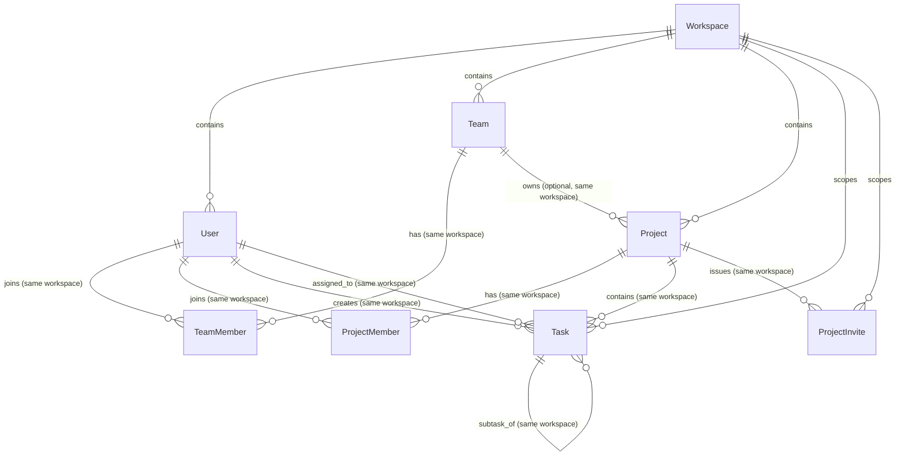

# Database Low-Level Design (LLD): Core Workspace Domain

## 1. Document Overview & Context

This document is the **Low-Level Design (LLD)** for the foundational relational database schema of **Company Brain**, building directly upon the High-Level Design in [`docs/architecture/overview.md`](file:///F:/Projects/Fabric/docs/architecture/overview.md) and the operating manual in [`AGENTS.md`](file:///F:/Projects/Fabric/AGENTS.md).

It formalizes the data models, exact PostgreSQL data types, foreign key cascades, constraints, multi-tenant boundaries, and indexing strategies for the eight core domain entities:

1. **`Workspace`**
2. **`User`**
3. **`Team`**
4. **`TeamMember`**
5. **`Project`**
6. **`ProjectMember`**
7. **`ProjectInvite`**
8. **`Task`**

> [!IMPORTANT]
> **Design-First Rule**: This document is an architectural specification under review. No implementation code, ORM models, or migration scripts will be written until this design is reviewed and approved.

---

## 2. Design Principles & Architectural Invariants

1. **Preserve the Team-First Model**: The fundamental product model is:
   ```text
   Workspace → Users / Teams / Projects → Tasks
   ```
   A `Workspace` represents any collaborative group—such as a startup, company, college team, hackathon squad, research lab, or open-source collective. No corporate-only assumptions (such as mandatory enterprise SSO, employee hierarchies, or payroll silos) exist in the core domain.
2. **Strict UUIDv7 Primary Keys**: All primary keys are 128-bit `UUID`s generated strictly by the application layer as time-ordered **UUIDv7** (RFC 9562). We explicitly omit database defaults like `gen_random_uuid()` (which produces UUIDv4), preventing accidental index fragmentation or silent degradation.
3. **Database-Enforced Workspace Consistency (Composite Foreign Keys)**: Tenant isolation is not left solely to application queries. Every tenant-scoped entity implements composite uniqueness on `(id, workspace_id)`, and all intra-workspace relationships reference `(target_id, workspace_id)` via composite foreign keys. It is physically impossible at the database constraint level for a project, team, task, or membership to reference a user or entity from a foreign workspace.
4. **Soft Deletion by Default with Restrictive Physical Delete Guardrails**: Normal application deletion is purely soft deletion (`deleted_at = NOW()`). Physical database deletion of core entities uses `ON DELETE RESTRICT` to prevent accidental cascading destruction of workspace history. Physical cascades (`ON DELETE CASCADE`) are reserved strictly for transient association/join records (`team_members`, `project_members`, `project_invites`).
5. **Authentication Preparation Only**: Columns such as `auth_provider` and `auth_provider_id` exist solely to make the schema forward-compatible. **No OAuth flows, Google login, GitHub login, SSO, or authentication services are implemented in this phase.**
6. **Contextual Roles, Not a Full Authorization Engine**: The roles defined on workspaces, teams, and projects are relational context attributes. They do **not** constitute a complete authorization engine. OpenFGA, Zanzibar policy engines, and dynamic permission resolution are deferred to future phases.
7. **Stable Graph Identity**: Every entity's UUID maps deterministically into a canonical URN for the derived Knowledge Graph.

---

## 3. Stable Primary Keys: Application-Generated UUIDv7

### Decision: Application-Generated UUIDv7 Only
- **PostgreSQL Column Type**: `id UUID PRIMARY KEY` (with **NO** database default).
- **Generation Layer**: The application service generates an RFC 9562 time-ordered UUIDv7 before persisting an entity.
- **Rationale**:
  - PostgreSQL's built-in `gen_random_uuid()` produces random **UUIDv4**. Using `gen_random_uuid()` as a default while claiming UUIDv7 identity is inconsistent and risks silent UUIDv4 insertion if an ID is omitted.
  - UUIDv7 encodes a Unix millisecond timestamp in its most significant 48 bits, guaranteeing monotonic index locality and eliminating B-tree page splits.
  - Having the ID available in application memory prior to database insertion simplifies event dispatch, canonical URN construction, and outbox pattern implementations.
  - If an `INSERT` statement omits the `id`, PostgreSQL will raise an immediate non-null violation rather than silently falling back to a non-time-ordered UUID.

### Canonical Graph URN Scheme

When the Knowledge Compiler extracts graph nodes from relational records, it maps primary keys to canonical URNs:

| Entity | Relational PK | Knowledge Graph Canonical Node ID | Graph Label |
| :--- | :--- | :--- | :--- |
| **Workspace** | `id` (UUIDv7) | `urn:fabric:workspace:<workspace_id>` | `:Workspace` |
| **User** | `id` (UUIDv7) | `urn:fabric:user:<user_id>` | `:User` |
| **Team** | `id` (UUIDv7) | `urn:fabric:team:<team_id>` | `:Team` |
| **Project** | `id` (UUIDv7) | `urn:fabric:project:<project_id>` | `:Project` |
| **Task** | `id` (UUIDv7) | `urn:fabric:task:<task_id>` | `:Task` |

Membership records (`TeamMember`, `ProjectMember`) map directly to directional graph edges (`:MEMBER_OF`, `:CONTRIBUTOR_TO`, `:LEADS`) carrying provenance and temporal metadata.

---

## 4. Entity-Relationship Overview & Composite Consistency



### Composite Foreign Key Guarantee Matrix

To enforce workspace consistency at the database level, each scoped table exposes a composite unique constraint: `UNIQUE (id, workspace_id)`. Child tables reference both the entity ID and `workspace_id`.

| Source Relationship Table & Columns | Target Table & Referenced Columns | Database Invariant Enforced |
| :--- | :--- | :--- |
| `teams (created_by_user_id, workspace_id)` | `users (id, workspace_id)` | Team creator must belong to the exact same workspace. |
| `teams (lead_user_id, workspace_id)` | `users (id, workspace_id)` | Team lead must belong to the exact same workspace. |
| `team_members (team_id, workspace_id)` | `teams (id, workspace_id)` | Member cannot join a team outside their workspace. |
| `team_members (user_id, workspace_id)` | `users (id, workspace_id)` | User cannot be added to a team outside their workspace. |
| `projects (team_id, workspace_id)` | `teams (id, workspace_id)` | Project cannot be owned by a team in another workspace. |
| `projects (created_by_user_id, workspace_id)` | `users (id, workspace_id)` | Project creator must belong to the project's workspace. |
| `projects (lead_user_id, workspace_id)` | `users (id, workspace_id)` | Project lead must belong to the project's workspace. |
| `project_members (project_id, workspace_id)` | `projects (id, workspace_id)` | Project member grant must match project's workspace. |
| `project_members (user_id, workspace_id)` | `users (id, workspace_id)` | User cannot join a project from a foreign workspace. |
| `project_invites (project_id, workspace_id)` | `projects (id, workspace_id)` | Invite token cannot reference an out-of-workspace project. |
| `project_invites (invited_by_user_id, workspace_id)` | `users (id, workspace_id)` | Inviting user must belong to the project's workspace. |
| `project_invites (accepted_by_user_id, workspace_id)`| `users (id, workspace_id)` | Claiming user must belong to the project's workspace. |
| `tasks (project_id, workspace_id)` | `projects (id, workspace_id)` | Task must reside in the exact workspace of its project. |
| `tasks (creator_user_id, workspace_id)` | `users (id, workspace_id)` | Task creator must belong to the task's workspace. |
| `tasks (assignee_user_id, workspace_id)` | `users (id, workspace_id)` | Task assignee must belong to the task's workspace. |
| `tasks (parent_task_id, workspace_id)` | `tasks (id, workspace_id)` | Subtask cannot link to a parent task in another workspace. |

*Note on nullable composite foreign keys (such as `lead_user_id`, `team_id`, `assignee_user_id`, `parent_task_id`): Under standard SQL `MATCH SIMPLE` (PostgreSQL's default), if the referencing entity ID is `NULL`, the constraint is satisfied. When non-NULL, PostgreSQL strictly enforces that `(entity_id, workspace_id)` exists in the target table.*

---

## 5. Enumerations & Status Models

```sql
-- Workspace-level user contextual roles (relationship attribute, not complete auth engine)
CREATE TYPE workspace_role_enum AS ENUM (
    'owner',       -- Workspace creator / co-owner
    'admin',       -- Workspace administrator (manages projects, teams, settings)
    'member',      -- Standard workspace collaborator
    'guest'        -- Restricted participant (limited to explicit projects)
);

-- User account state
CREATE TYPE user_status_enum AS ENUM (
    'active',       -- Active participant
    'invited',      -- Invitation issued, pending activation
    'suspended',    -- Access temporarily suspended by admin
    'deactivated'   -- Offboarded user account
);

-- Team-level contextual roles
CREATE TYPE team_role_enum AS ENUM (
    'lead',         -- Team lead / coordinator
    'member',       -- Standard team member
    'contributor'   -- Affiliated collaborator
);

-- Project operational lifecycle state
CREATE TYPE project_status_enum AS ENUM (
    'planned',      -- Scheduled work
    'active',       -- Active execution
    'paused',       -- Paused / on hold
    'completed',    -- Goals delivered
    'archived'      -- Closed, read-only retention
);

-- Project visibility boundary
CREATE TYPE project_visibility_enum AS ENUM (
    'workspace',    -- Readable by all non-guest workspace members
    'private'       -- Restricted to explicit ProjectMembers and owning Team members
);

-- Project-level contextual roles
CREATE TYPE project_role_enum AS ENUM (
    'lead',         -- Project director / product owner
    'maintainer',   -- Core contributor with write/merge and task management rights
    'contributor',  -- Standard task assignee and contributor
    'viewer'        -- Read-only observer
);

-- Project invite lifecycle states
CREATE TYPE invite_status_enum AS ENUM (
    'pending',      -- Issued, awaiting claim
    'accepted',     -- Successfully claimed
    'declined',     -- Declined by recipient
    'expired',      -- Reached expiration timestamp without claim
    'revoked'       -- Cancelled by project or workspace administrator
);

-- Task workflow states
CREATE TYPE task_status_enum AS ENUM (
    'backlog',      -- Unscheduled candidate work
    'todo',         -- Ready for execution
    'in_progress',  -- Active work underway
    'in_review',    -- Pending peer review / testing
    'done',         -- Finished and verified
    'cancelled'     -- Discarded or invalidated
);

-- Task priority ranking
CREATE TYPE task_priority_enum AS ENUM (
    'urgent',       -- Immediate intervention required
    'high',         -- High priority for current milestone
    'medium',       -- Normal baseline
    'low',          -- Backlog or stretch item
    'none'          -- Unranked
);
```

---

## 6. Detailed Table Specifications

### 6.1 `workspaces`
The root administrative tenant. Houses users, teams, projects, tasks, and raw evidence.

| Column | Type | Nullable | Default | Description |
| :--- | :--- | :---: | :--- | :--- |
| `id` | `UUID` | **NO** | *None (UUIDv7 from App)* | Primary Key. |
| `name` | `VARCHAR(255)` | **NO** | | Display name (e.g. "Acme Labs", "Stanford NLP", "Fabric Pod"). |
| `slug` | `VARCHAR(100)` | **NO** | | URL-safe handle, lowercase alphanumeric and hyphens. |
| `description` | `TEXT` | YES | `NULL` | Workspace description or charter. |
| `avatar_url` | `VARCHAR(1024)` | YES | `NULL` | Public CDN URL for workspace icon. |
| `settings` | `JSONB` | **NO** | `'{}'::jsonb` | Extensible workspace configuration (retention, features). |
| `is_active` | `BOOLEAN` | **NO** | `TRUE` | Global kill-switch for workspace access. |
| `created_at` | `TIMESTAMPTZ` | **NO** | `NOW()` | Record creation timestamp. |
| `updated_at` | `TIMESTAMPTZ` | **NO** | `NOW()` | Last modification timestamp. |
| `deleted_at` | `TIMESTAMPTZ` | YES | `NULL` | Soft deletion timestamp. |

- **Constraints & Indexes**:
  - `pk_workspaces`: `PRIMARY KEY (id)`
  - `uq_workspaces_slug_active`: `UNIQUE (slug) WHERE deleted_at IS NULL`
  - `idx_workspaces_active`: `INDEX (is_active) WHERE deleted_at IS NULL`

---

### 6.2 `users`
An individual participant within a Workspace. A user belongs strictly to one Workspace record.

> [!NOTE]
> `auth_provider` and `auth_provider_id` are preparatory schema fields for future identity mapping. **No external OAuth, Google, GitHub, or SSO services will be built in Phase 1.**

| Column | Type | Nullable | Default | Description |
| :--- | :--- | :---: | :--- | :--- |
| `id` | `UUID` | **NO** | *None (UUIDv7 from App)* | Primary Key. |
| `workspace_id` | `UUID` | **NO** | | FK to `workspaces(id)` ON DELETE RESTRICT. |
| `email` | `VARCHAR(320)` | **NO** | | Participant's contact or work email. |
| `display_name` | `VARCHAR(255)` | **NO** | | Human-readable name. |
| `handle` | `VARCHAR(100)` | **NO** | | Mention tag within the workspace (e.g. `akanti`). |
| `avatar_url` | `VARCHAR(1024)` | YES | `NULL` | Profile avatar image URL. |
| `auth_provider` | `VARCHAR(50)` | **NO** | `'local'` | Future auth provider tag (`'local'`, `'google'`, `'github'`). |
| `auth_provider_id` | `VARCHAR(255)` | YES | `NULL` | External subject ID from future auth provider. |
| `workspace_role` | `workspace_role_enum` | **NO** | `'member'` | Contextual role tier (`owner`, `admin`, `member`, `guest`). |
| `status` | `user_status_enum` | **NO** | `'active'` | Account state (`active`, `invited`, `suspended`, `deactivated`). |
| `timezone` | `VARCHAR(50)` | **NO** | `'UTC'` | User's preferred IANA timezone. |
| `metadata` | `JSONB` | **NO** | `'{}'::jsonb` | Extensible profile attributes and skill tags. |
| `created_at` | `TIMESTAMPTZ` | **NO** | `NOW()` | Record creation timestamp. |
| `updated_at` | `TIMESTAMPTZ` | **NO** | `NOW()` | Last modification timestamp. |
| `deleted_at` | `TIMESTAMPTZ` | YES | `NULL` | Soft deletion timestamp. |

- **Constraints & Indexes**:
  - `pk_users`: `PRIMARY KEY (id)`
  - `fk_users_workspace`: `FOREIGN KEY (workspace_id) REFERENCES workspaces(id) ON DELETE RESTRICT`
  - `uq_users_id_workspace`: `UNIQUE (id, workspace_id)` *(Required for composite foreign keys)*
  - `uq_users_workspace_email`: `UNIQUE (workspace_id, email) WHERE deleted_at IS NULL`
  - `uq_users_workspace_handle`: `UNIQUE (workspace_id, handle) WHERE deleted_at IS NULL`
  - `idx_users_workspace_status`: `INDEX (workspace_id, status)`
  - `idx_users_auth_lookup`: `INDEX (workspace_id, auth_provider, auth_provider_id) WHERE deleted_at IS NULL`
  - `idx_users_workspace_role`: `INDEX (workspace_id, workspace_role)`

---

### 6.3 `teams`
A collaborative group within a Workspace.

| Column | Type | Nullable | Default | Description |
| :--- | :--- | :---: | :--- | :--- |
| `id` | `UUID` | **NO** | *None (UUIDv7 from App)* | Primary Key. |
| `workspace_id` | `UUID` | **NO** | | FK to `workspaces(id)` ON DELETE RESTRICT. |
| `name` | `VARCHAR(255)` | **NO** | | Team title (e.g. "Platform Core", "ML Pod"). |
| `slug` | `VARCHAR(100)` | **NO** | | URL/mention slug (e.g. "platform-core"). |
| `description` | `TEXT` | YES | `NULL` | Team charter or focus area. |
| `created_by_user_id` | `UUID` | **NO** | | FK to `users(id, workspace_id)` ON DELETE RESTRICT. |
| `lead_user_id` | `UUID` | YES | `NULL` | FK to `users(id, workspace_id)` ON DELETE SET NULL. |
| `is_private` | `BOOLEAN` | **NO** | `FALSE` | If true, only team members can view internal discussions. |
| `metadata` | `JSONB` | **NO** | `'{}'::jsonb` | Extensible team attributes. |
| `created_at` | `TIMESTAMPTZ` | **NO** | `NOW()` | Record creation timestamp. |
| `updated_at` | `TIMESTAMPTZ` | **NO** | `NOW()` | Last modification timestamp. |
| `deleted_at` | `TIMESTAMPTZ` | YES | `NULL` | Soft deletion timestamp. |

- **Constraints & Indexes**:
  - `pk_teams`: `PRIMARY KEY (id)`
  - `fk_teams_workspace`: `FOREIGN KEY (workspace_id) REFERENCES workspaces(id) ON DELETE RESTRICT`
  - `uq_teams_id_workspace`: `UNIQUE (id, workspace_id)` *(Required for composite foreign keys)*
  - `fk_teams_creator`: `FOREIGN KEY (created_by_user_id, workspace_id) REFERENCES users(id, workspace_id) ON DELETE RESTRICT`
  - `fk_teams_lead`: `FOREIGN KEY (lead_user_id, workspace_id) REFERENCES users(id, workspace_id) ON DELETE SET NULL`
  - `uq_teams_workspace_slug`: `UNIQUE (workspace_id, slug) WHERE deleted_at IS NULL`
  - `idx_teams_workspace_lead`: `INDEX (workspace_id, lead_user_id)`
  - `idx_teams_workspace_private`: `INDEX (workspace_id, is_private)`

---

### 6.4 `team_members`
Association table connecting `Team` and `User`.

| Column | Type | Nullable | Default | Description |
| :--- | :--- | :---: | :--- | :--- |
| `id` | `UUID` | **NO** | *None (UUIDv7 from App)* | Primary Key. |
| `workspace_id` | `UUID` | **NO** | | FK to `workspaces(id)` ON DELETE RESTRICT. |
| `team_id` | `UUID` | **NO** | | FK to `teams(id, workspace_id)` ON DELETE CASCADE. |
| `user_id` | `UUID` | **NO** | | FK to `users(id, workspace_id)` ON DELETE CASCADE. |
| `role` | `team_role_enum` | **NO** | `'member'` | Contextual role in team (`lead`, `member`, `contributor`). |
| `joined_at` | `TIMESTAMPTZ` | **NO** | `NOW()` | Membership effective start timestamp. |
| `created_at` | `TIMESTAMPTZ` | **NO** | `NOW()` | Record creation timestamp. |
| `updated_at` | `TIMESTAMPTZ` | **NO** | `NOW()` | Last modification timestamp. |

- **Constraints & Indexes**:
  - `pk_team_members`: `PRIMARY KEY (id)`
  - `fk_team_members_workspace`: `FOREIGN KEY (workspace_id) REFERENCES workspaces(id) ON DELETE RESTRICT`
  - `fk_team_members_team`: `FOREIGN KEY (team_id, workspace_id) REFERENCES teams(id, workspace_id) ON DELETE CASCADE`
  - `fk_team_members_user`: `FOREIGN KEY (user_id, workspace_id) REFERENCES users(id, workspace_id) ON DELETE CASCADE`
  - `uq_team_members_pair`: `UNIQUE (team_id, user_id)`
  - `idx_team_members_workspace_user`: `INDEX (workspace_id, user_id)`
  - `idx_team_members_workspace_roster`: `INDEX (workspace_id, team_id, role)`

---

### 6.5 `projects`
A scoped initiative, code repository, or deliverable.

| Column | Type | Nullable | Default | Description |
| :--- | :--- | :---: | :--- | :--- |
| `id` | `UUID` | **NO** | *None (UUIDv7 from App)* | Primary Key. |
| `workspace_id` | `UUID` | **NO** | | FK to `workspaces(id)` ON DELETE RESTRICT. |
| `team_id` | `UUID` | YES | `NULL` | FK to `teams(id, workspace_id)` ON DELETE SET NULL. |
| `name` | `VARCHAR(255)` | **NO** | | Project title (e.g. "Ingestion Pipeline", "Q3 Paper"). |
| `slug` | `VARCHAR(100)` | **NO** | | Key/identifier (e.g. "pipe-v1"). |
| `description` | `TEXT` | YES | `NULL` | Project scope, specification, or objectives. |
| `created_by_user_id` | `UUID` | **NO** | | FK to `users(id, workspace_id)` ON DELETE RESTRICT. |
| `lead_user_id` | `UUID` | YES | `NULL` | FK to `users(id, workspace_id)` ON DELETE SET NULL. |
| `status` | `project_status_enum` | **NO** | `'active'` | Lifecycle state (`planned`, `active`, `paused`, `completed`, `archived`). |
| `visibility` | `project_visibility_enum` | **NO** | `'workspace'` | Scope (`workspace` vs `private`). |
| `start_date` | `DATE` | YES | `NULL` | Planned commencement date. |
| `target_date` | `DATE` | YES | `NULL` | Target completion date. |
| `metadata` | `JSONB` | **NO** | `'{}'::jsonb` | Extensible metadata. |
| `created_at` | `TIMESTAMPTZ` | **NO** | `NOW()` | Record creation timestamp. |
| `updated_at` | `TIMESTAMPTZ` | **NO** | `NOW()` | Last modification timestamp. |
| `deleted_at` | `TIMESTAMPTZ` | YES | `NULL` | Soft deletion timestamp. |

- **Constraints & Indexes**:
  - `pk_projects`: `PRIMARY KEY (id)`
  - `fk_projects_workspace`: `FOREIGN KEY (workspace_id) REFERENCES workspaces(id) ON DELETE RESTRICT`
  - `uq_projects_id_workspace`: `UNIQUE (id, workspace_id)` *(Required for composite foreign keys)*
  - `fk_projects_team`: `FOREIGN KEY (team_id, workspace_id) REFERENCES teams(id, workspace_id) ON DELETE SET NULL`
  - `fk_projects_creator`: `FOREIGN KEY (created_by_user_id, workspace_id) REFERENCES users(id, workspace_id) ON DELETE RESTRICT`
  - `fk_projects_lead`: `FOREIGN KEY (lead_user_id, workspace_id) REFERENCES users(id, workspace_id) ON DELETE SET NULL`
  - `uq_projects_workspace_slug`: `UNIQUE (workspace_id, slug) WHERE deleted_at IS NULL`
  - `idx_projects_workspace_status`: `INDEX (workspace_id, status) WHERE deleted_at IS NULL`
  - `idx_projects_workspace_team`: `INDEX (workspace_id, team_id)`
  - `idx_projects_workspace_lead`: `INDEX (workspace_id, lead_user_id)`
  - `idx_projects_visibility`: `INDEX (workspace_id, visibility)`

---

### 6.6 `project_members`
Explicit project-level user access grants and roles.

| Column | Type | Nullable | Default | Description |
| :--- | :--- | :---: | :--- | :--- |
| `id` | `UUID` | **NO** | *None (UUIDv7 from App)* | Primary Key. |
| `workspace_id` | `UUID` | **NO** | | FK to `workspaces(id)` ON DELETE RESTRICT. |
| `project_id` | `UUID` | **NO** | | FK to `projects(id, workspace_id)` ON DELETE CASCADE. |
| `user_id` | `UUID` | **NO** | | FK to `users(id, workspace_id)` ON DELETE CASCADE. |
| `role` | `project_role_enum` | **NO** | `'contributor'` | Contextual role (`lead`, `maintainer`, `contributor`, `viewer`). |
| `joined_at` | `TIMESTAMPTZ` | **NO** | `NOW()` | Membership effective start timestamp. |
| `created_at` | `TIMESTAMPTZ` | **NO** | `NOW()` | Record creation timestamp. |
| `updated_at` | `TIMESTAMPTZ` | **NO** | `NOW()` | Last modification timestamp. |

- **Constraints & Indexes**:
  - `pk_project_members`: `PRIMARY KEY (id)`
  - `fk_project_members_workspace`: `FOREIGN KEY (workspace_id) REFERENCES workspaces(id) ON DELETE RESTRICT`
  - `fk_project_members_project`: `FOREIGN KEY (project_id, workspace_id) REFERENCES projects(id, workspace_id) ON DELETE CASCADE`
  - `fk_project_members_user`: `FOREIGN KEY (user_id, workspace_id) REFERENCES users(id, workspace_id) ON DELETE CASCADE`
  - `uq_project_members_pair`: `UNIQUE (project_id, user_id)`
  - `idx_project_members_user_projects`: `INDEX (workspace_id, user_id)`
  - `idx_project_members_project_roster`: `INDEX (workspace_id, project_id, role)`

---

### 6.7 `project_invites`
Secure invitation tokens for prospective project contributors.

| Column | Type | Nullable | Default | Description |
| :--- | :--- | :---: | :--- | :--- |
| `id` | `UUID` | **NO** | *None (UUIDv7 from App)* | Primary Key. |
| `workspace_id` | `UUID` | **NO** | | FK to `workspaces(id)` ON DELETE RESTRICT. |
| `project_id` | `UUID` | **NO** | | FK to `projects(id, workspace_id)` ON DELETE CASCADE. |
| `email` | `VARCHAR(320)` | **NO** | | Email address of the invited recipient. |
| `role` | `project_role_enum` | **NO** | `'contributor'` | Project role assigned upon claim. |
| `invited_by_user_id` | `UUID` | **NO** | | FK to `users(id, workspace_id)` ON DELETE CASCADE. |
| `token_hash` | `VARCHAR(128)` | **NO** | | SHA-256 hash of the secure bearer token. |
| `status` | `invite_status_enum` | **NO** | `'pending'` | Lifecycle state (`pending`, `accepted`, `declined`, `expired`, `revoked`). |
| `accepted_by_user_id` | `UUID` | YES | `NULL` | FK to `users(id, workspace_id)` ON DELETE SET NULL. |
| `accepted_at` | `TIMESTAMPTZ` | YES | `NULL` | Timestamp when invitation was claimed. |
| `expires_at` | `TIMESTAMPTZ` | **NO** | | Expiration timestamp (e.g. 7 days from issue). |
| `created_at` | `TIMESTAMPTZ` | **NO** | `NOW()` | Record creation timestamp. |
| `updated_at` | `TIMESTAMPTZ` | **NO** | `NOW()` | Last modification timestamp. |

- **Constraints & Indexes**:
  - `pk_project_invites`: `PRIMARY KEY (id)`
  - `fk_project_invites_workspace`: `FOREIGN KEY (workspace_id) REFERENCES workspaces(id) ON DELETE RESTRICT`
  - `fk_project_invites_project`: `FOREIGN KEY (project_id, workspace_id) REFERENCES projects(id, workspace_id) ON DELETE CASCADE`
  - `fk_project_invites_inviter`: `FOREIGN KEY (invited_by_user_id, workspace_id) REFERENCES users(id, workspace_id) ON DELETE CASCADE`
  - `fk_project_invites_claimed_by`: `FOREIGN KEY (accepted_by_user_id, workspace_id) REFERENCES users(id, workspace_id) ON DELETE SET NULL`
  - `uq_project_invites_token_hash`: `UNIQUE (token_hash)`
  - `uq_project_invites_active_recipient`: `UNIQUE (project_id, email) WHERE status = 'pending'`
  - `idx_project_invites_status_expires`: `INDEX (status, expires_at) WHERE status = 'pending'`
  - `idx_project_invites_workspace`: `INDEX (workspace_id, status)`

---

### 6.8 `tasks`
An actionable unit of work linked to a Project.

| Column | Type | Nullable | Default | Description |
| :--- | :--- | :---: | :--- | :--- |
| `id` | `UUID` | **NO** | *None (UUIDv7 from App)* | Primary Key. |
| `workspace_id` | `UUID` | **NO** | | FK to `workspaces(id)` ON DELETE RESTRICT. |
| `project_id` | `UUID` | **NO** | | FK to `projects(id, workspace_id)` ON DELETE RESTRICT. |
| `number` | `INTEGER` | **NO** | | Sequential task number scoped per project (`PROJ-1`, `PROJ-2`). |
| `title` | `VARCHAR(500)` | **NO** | | Summary of the task / action item. |
| `description` | `TEXT` | YES | `NULL` | Markdown description, acceptance criteria, or logs. |
| `status` | `task_status_enum` | **NO** | `'todo'` | Current workflow status. |
| `priority` | `task_priority_enum` | **NO** | `'medium'` | Task urgency / importance. |
| `creator_user_id` | `UUID` | **NO** | | FK to `users(id, workspace_id)` ON DELETE RESTRICT. |
| `assignee_user_id` | `UUID` | YES | `NULL` | FK to `users(id, workspace_id)` ON DELETE SET NULL. |
| `parent_task_id` | `UUID` | YES | `NULL` | FK to `tasks(id, workspace_id)` ON DELETE SET NULL. |
| `due_date` | `TIMESTAMPTZ` | YES | `NULL` | Optional deadline timestamp. |
| `completed_at` | `TIMESTAMPTZ` | YES | `NULL` | Set automatically when status transitions to `done`. |
| `metadata` | `JSONB` | **NO** | `'{}'::jsonb` | Story points, labels, and external source references. |
| `created_at` | `TIMESTAMPTZ` | **NO** | `NOW()` | Record creation timestamp. |
| `updated_at` | `TIMESTAMPTZ` | **NO** | `NOW()` | Last modification timestamp. |
| `deleted_at` | `TIMESTAMPTZ` | YES | `NULL` | Soft deletion timestamp. |

- **Constraints & Indexes**:
  - `pk_tasks`: `PRIMARY KEY (id)`
  - `fk_tasks_workspace`: `FOREIGN KEY (workspace_id) REFERENCES workspaces(id) ON DELETE RESTRICT`
  - `uq_tasks_id_workspace`: `UNIQUE (id, workspace_id)` *(Required for composite foreign keys)*
  - `fk_tasks_project`: `FOREIGN KEY (project_id, workspace_id) REFERENCES projects(id, workspace_id) ON DELETE RESTRICT`
  - `fk_tasks_creator`: `FOREIGN KEY (creator_user_id, workspace_id) REFERENCES users(id, workspace_id) ON DELETE RESTRICT`
  - `fk_tasks_assignee`: `FOREIGN KEY (assignee_user_id, workspace_id) REFERENCES users(id, workspace_id) ON DELETE SET NULL`
  - `fk_tasks_parent`: `FOREIGN KEY (parent_task_id, workspace_id) REFERENCES tasks(id, workspace_id) ON DELETE SET NULL`
  - `uq_tasks_project_number`: `UNIQUE (project_id, number)`
  - `idx_tasks_workspace_project_status`: `INDEX (workspace_id, project_id, status) WHERE deleted_at IS NULL`
  - `idx_tasks_workspace_assignee`: `INDEX (workspace_id, assignee_user_id, status) WHERE deleted_at IS NULL`
  - `idx_tasks_workspace_creator`: `INDEX (workspace_id, creator_user_id) WHERE deleted_at IS NULL`
  - `idx_tasks_parent`: `INDEX (parent_task_id) WHERE parent_task_id IS NOT NULL`
  - `idx_tasks_due_calendar`: `INDEX (workspace_id, due_date) WHERE due_date IS NOT NULL AND status NOT IN ('done', 'cancelled') AND deleted_at IS NULL`

---

## 7. Multi-Tenancy & Composite Key Architecture

### 7.1 Why Composite Foreign Keys?
In a standard multi-tenant schema with single-column foreign keys (`project_id REFERENCES projects(id)`), a software bug or misconfigured API endpoint could allow:
- Assigning a user from Workspace B to a team in Workspace A.
- Setting a task in Project A to have a parent task from Project B in a completely different tenant.
- Attaching a team from Workspace B to a project in Workspace A.

By defining `UNIQUE (id, workspace_id)` on parent entities and referencing `FOREIGN KEY (entity_id, workspace_id) REFERENCES parent(id, workspace_id)`, the PostgreSQL engine verifies that **both columns match the same row in the target table**. Cross-workspace relationships are rejected unconditionally by the database constraint engine.

### 7.2 Application Layer Invariant
Application services must always supply `workspace_id = :current_workspace_id` in all `SELECT`, `UPDATE`, and `DELETE` queries. Composite foreign keys act as a second layer of defense-in-depth, preventing cross-tenant leakage even if application logic is flawed.

---

## 8. Deletion & Retention Lifecycle: Soft vs. Physical

```text
                  ┌──────────────────────────────────────────────┐
                  │                 Active Record                │
                  └──────────────────────┬───────────────────────┘
                                         │
                                         ▼ Standard Application Deletion
                  ┌──────────────────────────────────────────────┐
                  │   Soft Deleted (deleted_at = NOW())          │
                  │   - Excluded from standard queries via index │
                  │   - Retained in Knowledge Graph history      │
                  │   - Preserves audit trails & provenance      │
                  └──────────────────────┬───────────────────────┘
                                         │
                                         ▼ Extraordinary Administrative Purge
                  ┌──────────────────────────────────────────────┐
                  │   Physical Database Deletion (DELETE FROM)   │
                  │   - Enforces RESTRICT on core entities       │
                  │   - Must be deleted in reverse dependency    │
                  └──────────────────────────────────────────────┘
```

### Deletion Semantics & Database FK Policy

1. **Standard Application Deletion = Soft Delete**:
   - `workspaces`, `users`, `teams`, `projects`, and `tasks` use `deleted_at TIMESTAMPTZ NULL`.
   - Day-to-day operations NEVER physically execute `DELETE FROM` on these tables.
   - Soft-deleted entities retain their provenance links and Knowledge Graph validity windows (`valid_to = deleted_at`).
   - Slugs and email unique constraints use `WHERE deleted_at IS NULL`, allowing handles to be reused after soft deletion if needed.

2. **Physical (Hard) Deletion Safeguards (`ON DELETE RESTRICT`)**:
   - A physical `DELETE FROM workspaces WHERE id = ...` will **fail with a foreign key violation** if users, teams, projects, or tasks exist in that workspace.
   - Similarly, a physical `DELETE FROM projects WHERE id = ...` will fail if tasks exist in that project (`fk_tasks_project ... ON DELETE RESTRICT`).
   - Physical destruction of an entire workspace or project is an exceptional, audited compliance event (e.g. GDPR right-to-be-forgotten) that must be handled via an explicit, ordered deletion script rather than an accidental single-query cascade.

3. **Where Physical Cascade (`ON DELETE CASCADE`) is Permitted**:
   - Pure join tables (`team_members`, `project_members`) and transient tokens (`project_invites`) use `ON DELETE CASCADE` because they represent transient relationships that have no semantic meaning once the parent team or project is physically purged.

### Deletion Behavior Matrix

| Entity | Primary Deletion Mode | Database FK Action on Hard Delete of Parent | Rationale |
| :--- | :--- | :--- | :--- |
| `workspaces` | Soft delete | N/A (Root entity) | Root tenant. |
| `users` | Soft delete | `ON DELETE RESTRICT` (from workspace) | Workspace cannot be physically deleted while users exist. |
| `teams` | Soft delete | `ON DELETE RESTRICT` (from workspace) | Workspace cannot be physically deleted while teams exist. |
| `team_members` | Hard delete | `ON DELETE CASCADE` (from team/user) | Association records have no independent existence. |
| `projects` | Soft delete | `ON DELETE RESTRICT` (from workspace) | Workspace cannot be physically deleted while projects exist. |
| `project_members`| Hard delete | `ON DELETE CASCADE` (from project/user) | Association records have no independent existence. |
| `project_invites`| Status transition | `ON DELETE CASCADE` (from project/user) | Invites purged if parent project is physically destroyed. |
| `tasks` | Soft delete | `ON DELETE RESTRICT` (from workspace & project) | Tasks cannot be accidentally purged by deleting a project. |

---

## 9. Project Invite Lifecycle & Cryptographic Protocol

```text
[ Admin / Lead ]
       │
       ▼ Generate 32-byte cryptographically secure random token (token_raw)
       ▼ Compute token_hash = SHA256(token_raw)
       ▼ INSERT INTO project_invites (status='pending', token_hash, expires_at=NOW() + 7 days)
       │
       ▼ Dispatch email with link containing token_raw
       │
[ Recipient ]
       │
       ▼ Clicks link with token_raw
       ▼ Backend computes SHA256(token_raw)
       ▼ SELECT FROM project_invites WHERE token_hash = :hash
       │
       ├─► IF status != 'pending' ──► ERROR: "Invite is no longer active"
       ├─► IF NOW() > expires_at   ──► UPDATE status='expired' ──► ERROR: "Invite expired"
       └─► IF valid:
             BEGIN TRANSACTION;
               1. Verify / Create user in workspace
               2. INSERT INTO project_members (project_id, user_id, role)
               3. UPDATE project_invites SET status='accepted', accepted_at=NOW(), accepted_by_user_id=user.id
             COMMIT;
```

### Protocol Safeguards
- **Zero Plaintext Tokens**: The raw token is never stored in the database. Only the SHA-256 hash is persisted.
- **Race Condition Prevention**: The acceptance transaction uses `SELECT ... FOR UPDATE` on the invite record to prevent double-claiming.
- **Resend Idempotency**: Resending an invite generates a new token and extends `expires_at`, invalidating any previously intercepted raw token.

---

## 10. Ownership & Contextual Roles

The initial roles defined in this LLD are **contextual relationship roles** that describe a user's standing within a specific domain boundary:

| Boundary | Contextual Role Enum | Purpose in Core Domain |
| :--- | :--- | :--- |
| **Workspace** | `workspace_role_enum` (`owner`, `admin`, `member`, `guest`) | Identifies workspace ownership, administrative capabilities, and guest restrictions. |
| **Team** | `team_role_enum` (`lead`, `member`, `contributor`) | Identifies team leads and active collaborators. |
| **Project** | `project_role_enum` (`lead`, `maintainer`, `contributor`, `viewer`) | Identifies project leads, core maintainers, contributors, and read-only observers. |

### Clear Authorization Boundary
- These enums are **relational attributes** used by application logic to determine basic workflow permissions (e.g., who can invite a member, who can archive a project, who can assign a task).
- They are **NOT** the complete authorization engine.
- OpenFGA integration, Zanzibar relationship-based access control (ReBAC), and dynamic policy evaluation will be designed in a dedicated authorization phase and documented in `docs/architecture/authorization.md`.

---

## 11. Preparation for Future ReBAC (OpenFGA) Alignment

When the authorization subsystem is implemented, the composite relational schema maps directly into Google Zanzibar / OpenFGA relationship tuples without schema migration:

| Relational State | Projected ReBAC Tuple (`object#relation@subject`) | Meaning |
| :--- | :--- | :--- |
| `users (workspace_role='owner')` | `workspace:<ws_id>#owner@user:<user_id>` | User is an owner of the Workspace. |
| `users (workspace_role='admin')` | `workspace:<ws_id>#admin@user:<user_id>` | User is an admin of the Workspace. |
| `users (workspace_role='member')` | `workspace:<ws_id>#member@user:<user_id>` | User is a member of the Workspace. |
| `team_members (role='lead')` | `team:<team_id>#lead@user:<user_id>` | User leads the Team. |
| `team_members (role='member')` | `team:<team_id>#member@user:<user_id>` | User is a member of the Team. |
| `projects (team_id)` | `project:<proj_id>#parent_team@team:<team_id>` | Team owns the Project. |
| `project_members (role='lead')` | `project:<proj_id>#lead@user:<user_id>` | User leads the Project. |
| `project_members (role='maintainer')` | `project:<proj_id>#maintainer@user:<user_id>` | User is a maintainer of the Project. |
| `project_members (role='contributor')` | `project:<proj_id>#contributor@user:<user_id>` | User is a contributor to the Project. |
| `project_members (role='viewer')` | `project:<proj_id>#viewer@user:<user_id>` | User is a viewer of the Project. |
| `tasks (project_id)` | `task:<task_id>#parent_project@project:<proj_id>` | Task belongs to Project. |
| `tasks (assignee_user_id)` | `task:<task_id>#assignee@user:<user_id>` | User is assigned to Task. |

---

## 12. Complete PostgreSQL DDL Specification

```sql
-- ============================================================================
-- Company Brain: Relational Schema (PostgreSQL 16+)
-- Core Domain: Workspaces, Users, Teams, Projects, Invites, Tasks
-- Note: Primary keys are UUIDv7 generated by the application layer.
--       No database default (e.g. gen_random_uuid) is used.
-- ============================================================================

-- Extensions (pgcrypto available if needed for server-side utilities)
CREATE EXTENSION IF NOT EXISTS "pgcrypto";

-- Enums
CREATE TYPE workspace_role_enum AS ENUM ('owner', 'admin', 'member', 'guest');
CREATE TYPE user_status_enum AS ENUM ('active', 'invited', 'suspended', 'deactivated');
CREATE TYPE team_role_enum AS ENUM ('lead', 'member', 'contributor');
CREATE TYPE project_status_enum AS ENUM ('planned', 'active', 'paused', 'completed', 'archived');
CREATE TYPE project_visibility_enum AS ENUM ('workspace', 'private');
CREATE TYPE project_role_enum AS ENUM ('lead', 'maintainer', 'contributor', 'viewer');
CREATE TYPE invite_status_enum AS ENUM ('pending', 'accepted', 'declined', 'expired', 'revoked');
CREATE TYPE task_status_enum AS ENUM ('backlog', 'todo', 'in_progress', 'in_review', 'done', 'cancelled');
CREATE TYPE task_priority_enum AS ENUM ('urgent', 'high', 'medium', 'low', 'none');

-- 1. Workspaces
CREATE TABLE workspaces (
    id UUID PRIMARY KEY,
    name VARCHAR(255) NOT NULL,
    slug VARCHAR(100) NOT NULL,
    description TEXT,
    avatar_url VARCHAR(1024),
    settings JSONB NOT NULL DEFAULT '{}'::jsonb,
    is_active BOOLEAN NOT NULL DEFAULT TRUE,
    created_at TIMESTAMPTZ NOT NULL DEFAULT NOW(),
    updated_at TIMESTAMPTZ NOT NULL DEFAULT NOW(),
    deleted_at TIMESTAMPTZ
);
CREATE UNIQUE INDEX uq_workspaces_slug ON workspaces (slug) WHERE deleted_at IS NULL;
CREATE INDEX idx_workspaces_active ON workspaces (is_active) WHERE deleted_at IS NULL;

-- 2. Users
CREATE TABLE users (
    id UUID PRIMARY KEY,
    workspace_id UUID NOT NULL REFERENCES workspaces(id) ON DELETE RESTRICT,
    email VARCHAR(320) NOT NULL,
    display_name VARCHAR(255) NOT NULL,
    handle VARCHAR(100) NOT NULL,
    avatar_url VARCHAR(1024),
    auth_provider VARCHAR(50) NOT NULL DEFAULT 'local',
    auth_provider_id VARCHAR(255),
    workspace_role workspace_role_enum NOT NULL DEFAULT 'member',
    status user_status_enum NOT NULL DEFAULT 'active',
    timezone VARCHAR(50) NOT NULL DEFAULT 'UTC',
    metadata JSONB NOT NULL DEFAULT '{}'::jsonb,
    created_at TIMESTAMPTZ NOT NULL DEFAULT NOW(),
    updated_at TIMESTAMPTZ NOT NULL DEFAULT NOW(),
    deleted_at TIMESTAMPTZ,
    CONSTRAINT uq_users_id_workspace UNIQUE (id, workspace_id)
);
CREATE UNIQUE INDEX uq_users_workspace_email ON users (workspace_id, email) WHERE deleted_at IS NULL;
CREATE UNIQUE INDEX uq_users_workspace_handle ON users (workspace_id, handle) WHERE deleted_at IS NULL;
CREATE INDEX idx_users_workspace_status ON users (workspace_id, status);
CREATE INDEX idx_users_auth_lookup ON users (workspace_id, auth_provider, auth_provider_id) WHERE deleted_at IS NULL;
CREATE INDEX idx_users_workspace_role ON users (workspace_id, workspace_role);

-- 3. Teams
CREATE TABLE teams (
    id UUID PRIMARY KEY,
    workspace_id UUID NOT NULL REFERENCES workspaces(id) ON DELETE RESTRICT,
    name VARCHAR(255) NOT NULL,
    slug VARCHAR(100) NOT NULL,
    description TEXT,
    created_by_user_id UUID NOT NULL,
    lead_user_id UUID,
    is_private BOOLEAN NOT NULL DEFAULT FALSE,
    metadata JSONB NOT NULL DEFAULT '{}'::jsonb,
    created_at TIMESTAMPTZ NOT NULL DEFAULT NOW(),
    updated_at TIMESTAMPTZ NOT NULL DEFAULT NOW(),
    deleted_at TIMESTAMPTZ,
    CONSTRAINT uq_teams_id_workspace UNIQUE (id, workspace_id),
    CONSTRAINT fk_teams_creator FOREIGN KEY (created_by_user_id, workspace_id) REFERENCES users(id, workspace_id) ON DELETE RESTRICT,
    CONSTRAINT fk_teams_lead FOREIGN KEY (lead_user_id, workspace_id) REFERENCES users(id, workspace_id) ON DELETE SET NULL
);
CREATE UNIQUE INDEX uq_teams_workspace_slug ON teams (workspace_id, slug) WHERE deleted_at IS NULL;
CREATE INDEX idx_teams_workspace_lead ON teams (workspace_id, lead_user_id);
CREATE INDEX idx_teams_workspace_private ON teams (workspace_id, is_private);

-- 4. Team Members
CREATE TABLE team_members (
    id UUID PRIMARY KEY,
    workspace_id UUID NOT NULL REFERENCES workspaces(id) ON DELETE RESTRICT,
    team_id UUID NOT NULL,
    user_id UUID NOT NULL,
    role team_role_enum NOT NULL DEFAULT 'member',
    joined_at TIMESTAMPTZ NOT NULL DEFAULT NOW(),
    created_at TIMESTAMPTZ NOT NULL DEFAULT NOW(),
    updated_at TIMESTAMPTZ NOT NULL DEFAULT NOW(),
    CONSTRAINT uq_team_members_pair UNIQUE (team_id, user_id),
    CONSTRAINT fk_team_members_team FOREIGN KEY (team_id, workspace_id) REFERENCES teams(id, workspace_id) ON DELETE CASCADE,
    CONSTRAINT fk_team_members_user FOREIGN KEY (user_id, workspace_id) REFERENCES users(id, workspace_id) ON DELETE CASCADE
);
CREATE INDEX idx_team_members_workspace_user ON team_members (workspace_id, user_id);
CREATE INDEX idx_team_members_workspace_roster ON team_members (workspace_id, team_id, role);

-- 5. Projects
CREATE TABLE projects (
    id UUID PRIMARY KEY,
    workspace_id UUID NOT NULL REFERENCES workspaces(id) ON DELETE RESTRICT,
    team_id UUID,
    name VARCHAR(255) NOT NULL,
    slug VARCHAR(100) NOT NULL,
    description TEXT,
    created_by_user_id UUID NOT NULL,
    lead_user_id UUID,
    status project_status_enum NOT NULL DEFAULT 'active',
    visibility project_visibility_enum NOT NULL DEFAULT 'workspace',
    start_date DATE,
    target_date DATE,
    metadata JSONB NOT NULL DEFAULT '{}'::jsonb,
    created_at TIMESTAMPTZ NOT NULL DEFAULT NOW(),
    updated_at TIMESTAMPTZ NOT NULL DEFAULT NOW(),
    deleted_at TIMESTAMPTZ,
    CONSTRAINT uq_projects_id_workspace UNIQUE (id, workspace_id),
    CONSTRAINT fk_projects_team FOREIGN KEY (team_id, workspace_id) REFERENCES teams(id, workspace_id) ON DELETE SET NULL,
    CONSTRAINT fk_projects_creator FOREIGN KEY (created_by_user_id, workspace_id) REFERENCES users(id, workspace_id) ON DELETE RESTRICT,
    CONSTRAINT fk_projects_lead FOREIGN KEY (lead_user_id, workspace_id) REFERENCES users(id, workspace_id) ON DELETE SET NULL
);
CREATE UNIQUE INDEX uq_projects_workspace_slug ON projects (workspace_id, slug) WHERE deleted_at IS NULL;
CREATE INDEX idx_projects_workspace_status ON projects (workspace_id, status) WHERE deleted_at IS NULL;
CREATE INDEX idx_projects_workspace_team ON projects (workspace_id, team_id);
CREATE INDEX idx_projects_workspace_lead ON projects (workspace_id, lead_user_id);
CREATE INDEX idx_projects_visibility ON projects (workspace_id, visibility);

-- 6. Project Members
CREATE TABLE project_members (
    id UUID PRIMARY KEY,
    workspace_id UUID NOT NULL REFERENCES workspaces(id) ON DELETE RESTRICT,
    project_id UUID NOT NULL,
    user_id UUID NOT NULL,
    role project_role_enum NOT NULL DEFAULT 'contributor',
    joined_at TIMESTAMPTZ NOT NULL DEFAULT NOW(),
    created_at TIMESTAMPTZ NOT NULL DEFAULT NOW(),
    updated_at TIMESTAMPTZ NOT NULL DEFAULT NOW(),
    CONSTRAINT uq_project_members_pair UNIQUE (project_id, user_id),
    CONSTRAINT fk_project_members_project FOREIGN KEY (project_id, workspace_id) REFERENCES projects(id, workspace_id) ON DELETE CASCADE,
    CONSTRAINT fk_project_members_user FOREIGN KEY (user_id, workspace_id) REFERENCES users(id, workspace_id) ON DELETE CASCADE
);
CREATE INDEX idx_project_members_workspace_user ON project_members (workspace_id, user_id);
CREATE INDEX idx_project_members_workspace_roster ON project_members (workspace_id, project_id, role);

-- 7. Project Invites
CREATE TABLE project_invites (
    id UUID PRIMARY KEY,
    workspace_id UUID NOT NULL REFERENCES workspaces(id) ON DELETE RESTRICT,
    project_id UUID NOT NULL,
    email VARCHAR(320) NOT NULL,
    role project_role_enum NOT NULL DEFAULT 'contributor',
    invited_by_user_id UUID NOT NULL,
    token_hash VARCHAR(128) NOT NULL,
    status invite_status_enum NOT NULL DEFAULT 'pending',
    accepted_by_user_id UUID,
    accepted_at TIMESTAMPTZ,
    expires_at TIMESTAMPTZ NOT NULL,
    created_at TIMESTAMPTZ NOT NULL DEFAULT NOW(),
    updated_at TIMESTAMPTZ NOT NULL DEFAULT NOW(),
    CONSTRAINT uq_project_invites_token_hash UNIQUE (token_hash),
    CONSTRAINT fk_project_invites_project FOREIGN KEY (project_id, workspace_id) REFERENCES projects(id, workspace_id) ON DELETE CASCADE,
    CONSTRAINT fk_project_invites_inviter FOREIGN KEY (invited_by_user_id, workspace_id) REFERENCES users(id, workspace_id) ON DELETE CASCADE,
    CONSTRAINT fk_project_invites_claimed_by FOREIGN KEY (accepted_by_user_id, workspace_id) REFERENCES users(id, workspace_id) ON DELETE SET NULL
);
CREATE UNIQUE INDEX uq_project_invites_active ON project_invites (project_id, email) WHERE status = 'pending';
CREATE INDEX idx_project_invites_status_expires ON project_invites (status, expires_at) WHERE status = 'pending';
CREATE INDEX idx_project_invites_workspace ON project_invites (workspace_id, status);

-- 8. Tasks
CREATE TABLE tasks (
    id UUID PRIMARY KEY,
    workspace_id UUID NOT NULL REFERENCES workspaces(id) ON DELETE RESTRICT,
    project_id UUID NOT NULL,
    number INTEGER NOT NULL,
    title VARCHAR(500) NOT NULL,
    description TEXT,
    status task_status_enum NOT NULL DEFAULT 'todo',
    priority task_priority_enum NOT NULL DEFAULT 'medium',
    creator_user_id UUID NOT NULL,
    assignee_user_id UUID,
    parent_task_id UUID,
    due_date TIMESTAMPTZ,
    completed_at TIMESTAMPTZ,
    metadata JSONB NOT NULL DEFAULT '{}'::jsonb,
    created_at TIMESTAMPTZ NOT NULL DEFAULT NOW(),
    updated_at TIMESTAMPTZ NOT NULL DEFAULT NOW(),
    deleted_at TIMESTAMPTZ,
    CONSTRAINT uq_tasks_id_workspace UNIQUE (id, workspace_id),
    CONSTRAINT uq_tasks_project_number UNIQUE (project_id, number),
    CONSTRAINT fk_tasks_project FOREIGN KEY (project_id, workspace_id) REFERENCES projects(id, workspace_id) ON DELETE RESTRICT,
    CONSTRAINT fk_tasks_creator FOREIGN KEY (creator_user_id, workspace_id) REFERENCES users(id, workspace_id) ON DELETE RESTRICT,
    CONSTRAINT fk_tasks_assignee FOREIGN KEY (assignee_user_id, workspace_id) REFERENCES users(id, workspace_id) ON DELETE SET NULL,
    CONSTRAINT fk_tasks_parent FOREIGN KEY (parent_task_id, workspace_id) REFERENCES tasks(id, workspace_id) ON DELETE SET NULL
);
CREATE INDEX idx_tasks_workspace_project_status ON tasks (workspace_id, project_id, status) WHERE deleted_at IS NULL;
CREATE INDEX idx_tasks_workspace_assignee ON tasks (workspace_id, assignee_user_id, status) WHERE deleted_at IS NULL;
CREATE INDEX idx_tasks_workspace_creator ON tasks (workspace_id, creator_user_id) WHERE deleted_at IS NULL;
CREATE INDEX idx_tasks_parent ON tasks (parent_task_id) WHERE parent_task_id IS NOT NULL;
CREATE INDEX idx_tasks_due_calendar ON tasks (workspace_id, due_date) WHERE due_date IS NOT NULL AND status NOT IN ('done', 'cancelled') AND deleted_at IS NULL;
```
