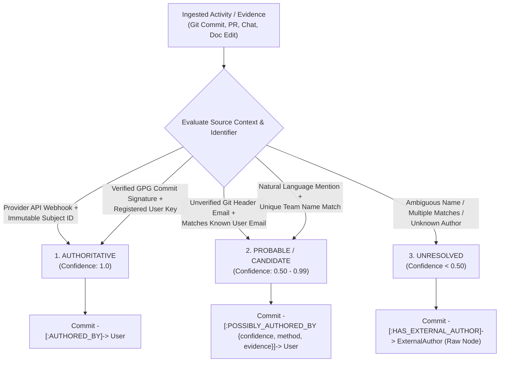
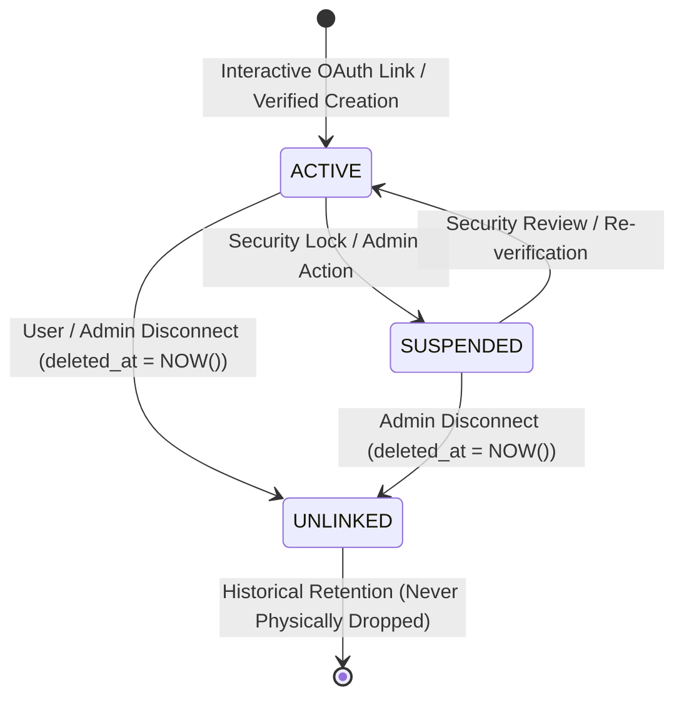

# Identity & Authentication Low-Level Design (LLD)

## 1. Document Overview & Context

This document is the **Low-Level Design (LLD)** for the **Identity, Authentication, and External Identity Mapping** subsystem of **Company Brain**. It builds directly upon the High-Level Design in [`docs/architecture/overview.md`](file:///F:/Projects/Fabric/docs/architecture/overview.md), the repository operating manual in [`AGENTS.md`](file:///F:/Projects/Fabric/AGENTS.md), and the database architecture in [`docs/architecture/database.md`](file:///F:/Projects/Fabric/docs/architecture/database.md).

Company Brain is explicitly **team-first rather than enterprise-only**. It serves collaborative groups across the spectrum:
- Startups and growth-stage companies
- Large enterprises and business units
- College and university engineering teams
- Hackathon squads
- Research laboratories
- Open-source collectives

The core hierarchy established in Phase 1 is:
```text
Workspace
    │
    ├── Users
    ├── Teams
    └── Projects
           │
           ├── Members
           └── Tasks
```

A `Workspace` represents the top-level administrative and tenancy boundary. To build a coherent organizational memory, Company Brain will eventually connect external collaborative tools:
- **Google Workspace** (Docs, Drive, Gmail, Calendar)
- **Microsoft 365 / Teams** (Chats, Channels, SharePoint, Outlook)
- **GitHub** (Repositories, Commits, Pull Requests, Issues, Discussions)

These external systems produce collaborative evidence and events authored by people who correspond to Company Brain users:

```text
GitHub:         github:abhishek-k  (ID: 4182931)
Google:         abhishek@example.com (Sub: 1029384756)
Microsoft:      abhishek@corp.com  (OID: 8a7b6c5d-...)
                          │
                          ▼
              Company Brain User (Canonical)
                          │
                          ▼
             User.id (UUIDv7: 0192a5b6-...)
```

### Critical Separation of Concerns

To prevent architectural collapse, the identity subsystem strictly separates six distinct concepts:

```text
┌────────────────────────────────────────────────────────────────────────┐
│ 1. Authentication        Who is logging into Company Brain right now?  │
├────────────────────────────────────────────────────────────────────────┤
│ 2. Canonical Identity    Who is the internal, sovereign User entity?   │
├────────────────────────────────────────────────────────────────────────┤
│ 3. External Identity     Which verified external accounts belong to    │
│    Mapping               this User?                                    │
├────────────────────────────────────────────────────────────────────────┤
│ 4. Identity Resolution   Which User authored or was mentioned in an   │
│                          ingested piece of evidence/event?             │
├────────────────────────────────────────────────────────────────────────┤
│ 5. Authorization         What resources is this User allowed to view?  │
├────────────────────────────────────────────────────────────────────────┤
│ 6. Graph Identity        How are people and their identities modeled   │
│                          in the derived Knowledge Graph?               │
└────────────────────────────────────────────────────────────────────────┘
```

> [!IMPORTANT]
> **Design-First Invariant**: This document is an architectural design and specification. **No authentication code, OAuth flows, login handlers, API endpoints, ORM models, or database migrations will be written in this phase.**

---

## 2. Design Principles & Architectural Invariants

1. **Sovereign Application Identity**: The internal `User.id` (RFC 9562 UUIDv7) is the immutable, canonical identity anchor across all Company Brain subsystems. External provider IDs (Google sub, GitHub ID, Microsoft OID) must never become primary keys or dictate the lifecycle of a Company Brain user.
2. **Context-Aware Identity Trust**: Trust is evaluated based on **both the identifier and the source/evidence context**. An immutable subject ID received via an authenticated provider API is authoritative; an email string appearing in arbitrary Git commit headers is candidate evidence, not proof of authorship.
3. **Deterministic Security Boundaries**:
   - Authentication and account linking are strictly deterministic, cryptographic, and explicit.
   - LLMs or heuristic algorithms must **never** be authoritative decision-makers for identity, account linking, or authentication.
4. **Evidence-First & Full Provenance**:
   - Every external identity association and every identity resolution decision must maintain an unalterable audit trail tracing to the exact proof, OAuth assertion, or ingestion evidence.
5. **Temporal Identity Validity**:
   - Identity connections change over time (e.g., an employee changes email, disconnects a GitHub account, or departs a team).
   - Past evidence (such as historical commits, comments, and decisions) remains permanently authored by the identity at that point in time. Unlinking an external account (`deleted_at = NOW()`) soft-unlinks the identity without erasing or orphaning historical evidence.
6. **No Silent Identity Merging**:
   - Ambiguous or probabilistic matches (e.g., shared display names, unverified commit emails) must **never** trigger automatic, silent account mergers. They produce candidate relationships with confidence scores and evidence links, requiring explicit confirmation.
7. **Authorization Separation**:
   - Authentication establishes identity (`user_id`, `workspace_id`).
   - Authorization deterministically evaluates resource access permissions **before** any data is retrieved or supplied to an LLM context.
8. **Multi-Tenant Workspace Integrity**:
   - A single human may participate in multiple Workspaces using the same external credentials (e.g., logging in with personal GitHub to a hackathon workspace and a research workspace). Tenancy boundaries must prevent cross-workspace data leakage while maintaining frictionless collaboration.

---

## 3. Authentication in Company Brain

### 3.1 Definition & Scope

Authentication answers precisely one question:
> **"Who is logging into Company Brain?"**

Authentication is an **interactive, synchronous, cryptographically verified proof of identity**. The user interacts directly with Company Brain via a web browser, CLI, or client application, and completes a challenge proving ownership of an identity.

Authentication is strictly distinct from authorization and data ingestion:
- Authentication establishes an active session and binds the client to a specific `User` within a `Workspace`.
- Authentication does **not** determine which projects, teams, or tasks the user can read (that is Authorization).
- Authentication does **not** process background events or parse git commit history (that is Ingestion & Resolution).

### 3.2 Provider Model & Architecture

Company Brain adopts a **pluggable identity provider (IdP) model**. In Phase 1 and future phases, authentication will support:

1. **OAuth 2.0 / OpenID Connect (OIDC)**:
   - **Google Workspace / Google Identity Services**: OIDC authorization code flow with PKCE.
   - **Microsoft 365 / Entra ID**: OIDC authorization code flow with PKCE via Microsoft Identity Platform.
   - **GitHub / GitHub Enterprise**: OAuth 2.0 web application flow with PKCE.
2. **Local / Passwordless (Future)**:
   - Magic link via verified email or WebAuthn/Passkeys for environments without third-party OAuth accounts.

```text
┌─────────────────────────────────────────────────────────────┐
│                    Web Browser / Client                     │
└──────────────┬───────────────────────────────▲──────────────┘
               │ 1. Initiate Login             │ 5. Session Cookie
               │    (Provider Selection)       │    or Bearer Token
               ▼                               │
┌──────────────────────────────────────────────┴──────────────┐
│                  Company Brain Auth Layer                   │
│  ┌────────────────────────────────────────────────────────┐ │
│  │ OIDC / OAuth 2.0 State Machine (PKCE, State, Nonce)   │ │
│  └───────┬────────────────────────────────────────▲───────┘ │
└──────────┼────────────────────────────────────────┼─────────┘
           │ 2. Redirect to IdP                     │ 4. Callback
           ▼                                        │    (Code + State)
┌───────────────────────────────────────────────────┴─────────┐
│               External Identity Provider                    │
│        (Google OIDC / Microsoft Entra / GitHub)             │
│                                                             │
│  - User authenticates                                       │
│  - IdP validates credentials & MFA                          │
│  - Issues signed ID Token / Authorization Code              │
└─────────────────────────────────────────────────────────────┘
```

### 3.3 Provider Boundary Principles

- **No Custom Passwords in V1**: Company Brain avoids storing password hashes or managing low-level credential security in early phases, delegating authentication to established OIDC/OAuth providers.
- **Provider Agnostic Core**: Core business logic interacts only with the canonical `User` entity. Code in `application/` or `domain/` never branches on `if provider == "google"` to make business decisions.
- **Token Exchange Boundary**: The auth layer exchanges the provider's authorization code for tokens, extracts and validates the cryptographic claims (`sub`, `iss`, `aud`, `exp`, `email_verified`), maps the subject to a Company Brain user, and issues a native Company Brain session (e.g., HTTP-only encrypted session cookie or short-lived JWT). External access tokens are handed off to secure token storage, never returned to the browser.

### 3.4 Initial Authentication vs. Authenticated Account Linking: State & Context Invariants

To avoid architectural confusion between initial login and subsequent account linking:

1. **Initial V1 Login / Join Flow**:
   - **No Authenticated User Exists Yet**: At login initiation, there is no active Company Brain session and no known `user_id`. Attempting to pass or require a `user_id` at this stage is impossible.
   - **Prior Workspace Context**: In accordance with the settled V1 decision ([Section 9.3](#93-architectural-decision-workspace-scoped-external-identities), [AD-ID-11](#17-architectural-decisions-decisions-record)), workspace context (`workspace_id` or workspace slug) is established *before* authentication begins (via a workspace-specific URL/subdomain or verified invitation/deep link).
   - **Cryptographic State Binding**: The initial OAuth/OIDC `state` parameter binds the login attempt to the **workspace context** and the initiating browser session using a cryptographically secure nonce/state mechanism (e.g., signed HMAC or JWE containing timestamp, nonce, workspace context, and transient browser CSRF cookie binding). It does **not** contain or require a `user_id`.
   - **User Resolution on Callback**: The `user_id` is resolved **only after** the provider validates credentials, issues tokens, and the auth layer maps the verified provider subject ID to that workspace's `User` record (or provisions the user record if completing a verified invitation).

2. **Authenticated Account Linking Flow ([Section 10.1](#101-the-linking-flow))**:
   - **Active Authenticated Session**: Operates strictly within an already authenticated session for an existing `User A` in `Workspace W`.
   - **User-Bound State**: Because `User A` and `Workspace W` are already authenticated and active, the OAuth `state` parameter for linking explicitly binds both `target workspace_id` and `user_id` (along with a session CSRF token and nonce) to ensure the newly linked external identity attaches strictly to that authenticated user upon callback.

---

## 4. Canonical Application Identity: The `User` Entity

### 4.1 The Canonical Anchor

The canonical user identity in Company Brain is the **`User` record** in the relational database:

```text
users
├── id (UUIDv7, RFC 9562) ── CANONICAL ANCHOR
├── workspace_id (UUIDv7) ── TENANCY BOUNDARY
├── email (VARCHAR(320))
├── display_name (VARCHAR(255))
├── handle (VARCHAR(100))
├── workspace_role (ENUM)
├── status (ENUM)
└── metadata (JSONB)
```

### 4.2 Why External IDs Must Never Be Primary

External provider IDs (e.g., Google `sub`, GitHub `id`, Microsoft `oid`) must **never** be used as the internal primary key or the primary identity symbol in Company Brain for fundamental architectural reasons:

1. **Provider Independence**: A user must be able to disconnect or rotate an external provider without invalidating foreign keys across teams, projects, tasks, comments, and audit logs.
2. **Multiple External Identities**: A single developer routinely uses a Google identity for documentation and email, and a GitHub identity for code and reviews. If a Google `sub` were the primary key, connecting GitHub would either be impossible or require brittle secondary schemas.
3. **Provider Collision & Migration**: Companies frequently migrate from Google Workspace to Microsoft 365 or rename organization domains. An internal UUID guarantees zero operational downtime or database foreign key refactoring during corporate IT migrations.
4. **Knowledge Graph Stability**: Canonical URNs (`urn:fabric:user:<uuid>`) in the Knowledge Graph and Vector Store must remain permanently stable even if external accounts are linked or unlinked.
5. **Time-Ordered Index Locality**: Application-generated UUIDv7 embeds millisecond-level timestamps, providing clustered B-tree index locality in PostgreSQL, whereas provider subject IDs are arbitrary strings or integers with no universal ordering.

---

## 5. External Identity Architecture (1:N Model)

### 5.1 Analysis of Existing Schema (`users.auth_provider`)

In Phase 1, `users` included two preparatory fields:
```sql
users.auth_provider     VARCHAR(50) NOT NULL DEFAULT 'local'
users.auth_provider_id  VARCHAR(255) NULL
```

#### Evaluation: Why This Is Insufficient
- **Strict 1:1 Limitation**: Storing provider information on the `users` table directly prevents a user from linking more than one provider. A user cannot have both their Google account (for Docs context) and GitHub account (for PR context) linked simultaneously.
- **Missing Ingestion Metadata**: Ingested events from GitHub often reference GitHub usernames (`login`), primary emails, and GPG key IDs. A single string field `auth_provider_id` cannot represent this multi-faceted external profile.
- **Inadequate Lifecycle Tracking**: Flat columns on `users` cannot record when an identity was connected, last authenticated, verified, or revoked.

### 5.2 The 1:N Conceptual Model

Company Brain requires a dedicated **1:N relation** between the canonical `User` and their `ExternalIdentity` records:

```text
                          ┌── Google Identity (OIDC sub: 1029384756...)
                          │   Email: alex@acme.com, hd: acme.com
                          │
Company Brain User ───────┼── GitHub Identity (GitHub ID: 4182931)
(id: 0192a5b6-...,        │   Username: alexvance, Email: alex@vance.net
 Workspace: Acme Labs)    │
                          └── Microsoft Identity (Entra OID: 8a7b6c5d-...)
                              UPN: alex@acmecorp.onmicrosoft.com
```

### 5.3 Proposed Entity Specification: `external_identities`

To support multiple external identities cleanly within the Phase 1 multi-tenant architecture, we propose the following schema for active design review:

```text
external_identities
├── id (UUIDv7, PK)
├── workspace_id (UUIDv7, FK -> workspaces.id ON DELETE RESTRICT)
├── user_id (UUIDv7, FK -> users.id ON DELETE CASCADE)
├── provider (VARCHAR(50), e.g. 'google', 'github', 'microsoft')
├── provider_subject_id (VARCHAR(255), Immutable Subject ID from Provider)
├── provider_email (VARCHAR(320), Primary Email asserted by Provider)
├── provider_username (VARCHAR(255), Handle/Username from Provider, e.g. GitHub login)
├── provider_display_name (VARCHAR(255), Profile name asserted by Provider)
├── provider_tenant_id (VARCHAR(255), Org/Tenant ID, e.g. Microsoft tid or Google hd)
├── provider_metadata (JSONB, Additional provider profile attributes)
├── is_primary (BOOLEAN, Default FALSE; denotes default login identity)
├── status (VARCHAR(20) / ENUM: 'active', 'suspended', Default 'active')
├── verified_at (TIMESTAMPTZ, Timestamp when ownership was verified)
├── last_authenticated_at (TIMESTAMPTZ, Last interactive login with this identity)
├── created_at (TIMESTAMPTZ, Record creation timestamp)
├── updated_at (TIMESTAMPTZ, Last modification timestamp)
└── deleted_at (TIMESTAMPTZ, Historical soft-unlink timestamp; NULL if active)
```

#### Relational Constraints & Invariants

1. **Workspace Integrity Composite Foreign Key**:
   - `FOREIGN KEY (user_id, workspace_id) REFERENCES users(id, workspace_id) ON DELETE CASCADE`
   - Guarantees an external identity cannot be associated with a user in a different workspace.
2. **Unique Provider Subject per Workspace**:
   - `UNIQUE (workspace_id, provider, provider_subject_id) WHERE deleted_at IS NULL`
   - Ensures an external account cannot be simultaneously linked to two distinct users in the same workspace.
3. **Primary Identity Invariant**:
   - `UNIQUE (workspace_id, user_id) WHERE is_primary = TRUE AND deleted_at IS NULL`
   - **Database Invariant**: An active User may have **at most one active primary authentication identity** within a workspace.
4. **Lookup Index for Fast Authentication**:
   - Covered directly by the composite unique index `(workspace_id, provider, provider_subject_id) WHERE deleted_at IS NULL`.
   - Enables constant-time user resolution upon OAuth callback within the provided workspace context without cross-workspace index scans.
5. **Email Lookup Index for Discovery & Candidate Matching**:
   - `INDEX (workspace_id, provider_email) WHERE deleted_at IS NULL`

---

## 6. Authentication vs. Entity Resolution

A core pitfall in organizational knowledge platforms is conflating **interactive authentication** with **data-driven identity resolution**.

```text
┌───────────────────────────────────┬───────────────────────────────────┐
│          AUTHENTICATION           │        IDENTITY RESOLUTION        │
├───────────────────────────────────┼───────────────────────────────────┤
│ "Who is logging into the system?" │ "Who authored or is mentioned in  │
│                                   │  this ingested evidence?"         │
├───────────────────────────────────┼───────────────────────────────────┤
│ Synchronous & Interactive         │ Asynchronous & Background         │
├───────────────────────────────────┼───────────────────────────────────┤
│ Driven by browser/client login    │ Driven by event ingestion workers │
├───────────────────────────────────┼───────────────────────────────────┤
│ Cryptographic proof (OIDC tokens, │ Heterogeneous, partial evidence   │
│ signatures, PKCE code exchange)   │ (git commits, mentions, emails)   │
├───────────────────────────────────┼───────────────────────────────────┤
│ Authoritative: directly binds     │ Inferential: requires confidence  │
│ session to a canonical User       │ scoring & deterministic guards    │
├───────────────────────────────────┼───────────────────────────────────┤
│ Binary outcome: Pass or Fail      │ Graduated: Authoritative,         │
│                                   │ Probable/Candidate, Unresolved    │
└───────────────────────────────────┴───────────────────────────────────┘
```

### 6.1 The Ingestion Challenge

Ingested data arrives from external webhooks and delta syncs in varying levels of clarity and trust:

```text
Scenario A: GitHub Pull Request Webhook Event
  author.id = 4182931  ── Authenticated GitHub API payload matches verified provider_subject_id
  Context: Authenticated provider payload.
  Result: 100% Deterministic & Authoritative match to User.

Scenario B: Git Commit in Ingested Repository
  author.email = "alex.vance@alum.mit.edu"
  author.name = "Alex Vance"
  Context: Arbitrary Git commit header (unauthenticated / forgeable).
  Result: Email matches a known user email, BUT source context is unauthenticated Git metadata.
  Result: Candidate / Probable evidence (POSSIBLY_AUTHORED_BY), NOT authoritative identity!

Scenario C: Slack Message
  text = "Hey @alex, can you check the navigation PR?"
  Context: Natural language mention in text body.
  Result: Probable or Unresolved candidate mention. Requires disambiguation.
```

### 6.2 Architectural Boundary

- The **Identity Subsystem** maintains the authoritative table of verified external identities (`external_identities`) and provides deterministic lookup interfaces.
- The **Knowledge Compiler** (Stage 2: Entity & Identity Resolution) queries the identity subsystem. When an exact, high-trust match exists, it records an authoritative relationship. When evidence is ambiguous or arrives from untrusted contexts (like unauthenticated Git commit headers), the Knowledge Compiler generates candidate links with confidence scores rather than altering identity records.

---

## 7. Deterministic vs. Probabilistic Identity Resolution

### 7.1 Context-Aware Identity Trust

Trust cannot be established by the identifier string alone. It must be evaluated based on **both the identifier and the evidence/source context**:

```text
Trust = Identifier Strength × Source Context Verifiability
```

| Source Context | Identifier Type | Trust Category | Resolution Action |
| :--- | :--- | :---: | :--- |
| **Authenticated Provider API / Webhook** (e.g. GitHub PR author, Slack API user) | Immutable Provider Subject ID (`sub`, `oid`, integer `id`) | **AUTHORITATIVE** (1.0) | Authoritative link: `(:Event)-[:AUTHORED_BY]->(:User)` |
| **Provider-Authenticated Session** (e.g. OIDC login, token verification) | Verified Primary Account Email | **AUTHORITATIVE** (1.0) | Account login and primary identity verification |
| **Explicit User/Admin Alias Registry** | Confirmed Author Alias (e.g. signed Git commit GPG key, confirmed alias) | **AUTHORITATIVE** (1.0) | Authoritative link: `(:Commit)-[:AUTHORED_BY]->(:User)` |
| **Arbitrary Git Commit Header** (Unauthenticated header text) | Provider-Verified Email (e.g. `alex@acme.com` in `git log`) | **PROBABLE / CANDIDATE** (0.85) | Candidate link: `(:Commit)-[:POSSIBLY_AUTHORED_BY]->(:User)` |
| **Document Body / Chat Mention** | Natural Language Mention (e.g. `"@alex"`, `"Alex Vance"`) | **PROBABLE / CANDIDATE** (0.60–0.80) | Candidate mention edge; disambiguated via project/team co-occurrence |
| **Unauthenticated Commit Header** | Unknown / Ambiguous Email or Name | **UNRESOLVED** (0.0) | Unresolved external author link: `(:Commit)-[:HAS_EXTERNAL_AUTHOR]->(:ExternalAuthor)`; requires explicit alias registration or claim |

### 7.2 Formalized Identity Confidence Levels

Company Brain formalizes three distinct confidence tiers for identity resolution during data ingestion:

```text
┌────────────────────────────────────────────────────────────────────────┐
│ 1. AUTHORITATIVE (Confidence = 1.0)                                     │
│    - Provenance: Cryptographically verified or direct provider API.   │
│    - Graph Representation: Confirmed identity semantic edge            │
│      (:Artifact)-[:AUTHORED_BY]->(:User)                              │
│    - Behavior: Fully trusted in search, provenance, and attribution.   │
├────────────────────────────────────────────────────────────────────────┤
│ 2. PROBABLE / CANDIDATE (Confidence ∈ [0.50, 0.99])                    │
│    - Provenance: Heuristic match (e.g., unverified commit email,       │
│      unique display name match, LLM mention extraction).               │
│    - Graph Representation: Candidate attribution edge                  │
│      (:Artifact)-[:POSSIBLY_AUTHORED_BY {confidence, method, evidence}]->(:User) │
│    - Metadata Retained: candidate_user_id, confidence, evidence_id,    │
│      resolution_method.                                                │
│    - Behavior: Searchable as tentative; promoted to AUTHORITATIVE only │
│      via explicit user/admin confirmation or alias verification.       │
├────────────────────────────────────────────────────────────────────────┤
│ 3. UNRESOLVED (Confidence < 0.50 or Conflicted)                        │
│    - Provenance: Ambiguous mention, unlinked external author, or       │
│      conflicting evidence.                                             │
│    - Graph Representation: Distinct external author edge               │
│      (:Artifact)-[:HAS_EXTERNAL_AUTHOR]->(:ExternalAuthor {raw_email, ...}) │
│    - Invariant: AUTHORED_BY is strictly reserved for confirmed Users;  │
│      unresolved external authors are connected via HAS_EXTERNAL_AUTHOR.│
│    - Behavior: Retains complete evidence so knowledge is not lost;     │
│      available in workspace admin triage for optional claim or alias.  │
└────────────────────────────────────────────────────────────────────────┘
```



### 7.3 The Deterministic LLM Guardrail Invariant

In adherence to [`AGENTS.md` Invariant 4 (Deterministic LLM Boundaries)](file:///F:/Projects/Fabric/AGENTS.md):
- **LLMs and heuristics interpret and propose; deterministic software validates and decides.**
- An LLM must **NEVER** have write authority to merge user accounts, mutate `users`, or insert authoritative records into `external_identities`.
- If an LLM or heuristic model suggests that `"Alex"` in a design document is `User: 0192a5b6-...`, that suggestion is stored strictly as a **candidate edge** (`:POSSIBLY_AUTHORED_BY`) with an explicit confidence score, evidence pointer, and `resolution_method = 'llm_extraction'`.
- Human confirmation (by a Workspace Admin or the target User) or cryptographic verification promotes a candidate edge into an authoritative link.

---

## 8. The Role of Email in Identity

A common design failure in modern software is treating **email as the permanent identity key**.

### 8.1 Why Email Is Not Identity

1. **Email Mutation**: People change emails due to legal name changes, corporate domain migrations (e.g., `@startup.io` to `@enterprise.com`), or ISP transitions.
2. **Aliases & Multi-Tenancy**: A single user may possess multiple emails:
   - Primary: `alex.vance@acme.com`
   - Alias: `alex@acme.com`, `avance@acme.com`
   - Personal/Open-Source: `alexvance@gmail.com`
   - Git Masked: `4182931+alexvance@users.noreply.github.com`
3. **Email Reassignment**: Corporate email addresses are often reassigned after an employee departs. If identity were anchored to `john@acme.com`, a new hire inheriting the address would inherit the predecessor's historical graph and access rights.
4. **Git Header Forgery**: Git commits do not authenticate email headers. Anyone can configure `git config user.email linus@torvalds.org` and push to a public branch. Treating unverified commit emails as authoritative identity permits trivial identity spoofing.

### 8.2 Canonical External Identifier Hierarchy

When binding an external identity, Company Brain relies on the provider's **immutable subject identifier**:

```text
Provider Subject ID (Immutable Key)
    ├── Google: OIDC 'sub' claim (e.g., "102938475619283746510")
    ├── Microsoft: Entra ID 'oid' (e.g., "c2b3a4d5-e6f7-8901-2345-6789abcdef01")
    └── GitHub: User integer ID (e.g., 4182931; NOT github login, which can be renamed!)
```

### 8.3 Contextual Rules for Email Usage

- **Interactive Authentication**: A provider-verified email (`email_verified = true` in an OIDC `id_token`) proves account ownership with that provider during interactive login or invite claiming.
- **Arbitrary Ingested Evidence**: An email appearing in raw ingested metadata (e.g., Git commit author field) is **never** treated as an authoritative authorship proof on its own. It is classified as `PROBABLE / CANDIDATE` evidence.
- **Authoritative Commit Attribution**: To establish an `AUTHORITATIVE` link from a Git commit to a User, the system requires either:
  1. A GitHub API event linking the commit directly to the authenticated GitHub User ID (`4182931`), OR
  2. A cryptographically verified commit signature (GPG/SSH) matching a public key explicitly registered by that User in Company Brain, OR
  3. Explicit human/admin verification confirming that commit author string.

---

## 9. Workspace Boundaries & Multi-Tenancy Scoping

### 9.1 Multi-Tenant Collaboration Scenarios

In Company Brain's team-first architecture, a single human may legitimately belong to multiple workspaces:

```text
Real-World Human: "Dr. Alex Vance"
  Google Account: alex@gmail.com (Sub: 1029384756)
  GitHub Account: alexvance (ID: 4182931)

  Workspace 1: "Stanford Robotics Lab"
    └── User Record: User_A (id: 0192a5b6-..., workspace_id: ws_stanford)
          Role: Owner

  Workspace 2: "Open-Source SLAM Pod"
    └── User Record: User_B (id: 0192a5c7-..., workspace_id: ws_slam)
          Role: Contributor
```

### 9.2 Scoping Analysis: Global vs. Workspace-Scoped Identities

| Dimension | Option A: Globally Unique Identities | Option B: Workspace-Scoped Identities (Approved Baseline) |
| :--- | :--- | :--- |
| **Model** | `(provider, provider_subject_id)` is globally unique across the whole database. | `(workspace_id, provider, provider_subject_id)` is unique per Workspace. |
| **Multi-Tenancy** | A human cannot use the same GitHub account across two distinct workspaces without a global "Account" abstraction. | Cleanly isolates every Workspace. A user links their GitHub account to Workspace 1 as User A, and to Workspace 2 as User B. |
| **Isolation & Security** | Risk of cross-workspace data leakage; Workspace A could query or infer memberships in Workspace B. | Strict multi-tenant isolation. Zero relational overlap between workspaces. Matches Phase 1 composite constraints. |
| **Data Deletion & GDPR** | Deleting Workspace A requires complex cascading or disassociating from global accounts. | Deleting Workspace A cascades cleanly (`ON DELETE RESTRICT/CASCADE`) within the workspace boundary. |

### 9.3 Architectural Decision: Workspace-Scoped External Identities

Company Brain adopts **Option B (Workspace-Scoped External Identities)**:
- Every record in `external_identities` belongs strictly to a `workspace_id`.
- The database enforces uniqueness on `(workspace_id, provider, provider_subject_id)`.
- The exact same external account (e.g., GitHub `4182931`) can be linked to User A in Workspace 1 and to User B in Workspace 2.
- Data, permissions, and knowledge graphs between Workspace 1 and Workspace 2 remain physically and logically isolated.

#### V1 Decision: Workspace-Contextual Authentication Only (Global Discovery Out of Scope)
Cross-workspace global discovery is **explicitly OUT OF SCOPE for V1**.

For V1, authentication must already have workspace context before login is completed. This workspace context must be provided through:
- A workspace-specific URL/subdomain (e.g., `acme.fabric.app/login` or `https://app.companybrain.io/login?workspace=acme-slug`), or
- An invitation or deep link containing verified workspace context (e.g., a project invite token or workspace join link).

The V1 authentication flow must **NOT** implement a global lookup such as:
> *"Find every workspace associated with this Google/GitHub/Microsoft identity."*

A user may belong to multiple workspaces, but each workspace authentication context resolves the external identity to that workspace's `User` record independently. There is no cross-workspace user directory, global credential index, or multi-workspace account picker in V1. Multi-workspace discovery and global identity indexing remain deferred to future phases beyond V1.

---

## 10. Account Linking & Security Model

Account linking allows a user to attach additional external identities (e.g., connecting a GitHub account after logging in with Google).

### 10.1 The Linking Flow

> [!NOTE]
> **Account Linking vs. Initial Login**:
> In this account-linking flow, User A is already authenticated within Workspace W, so including `workspace_id` and `user_id` in the OAuth state is appropriate and necessary to bind the incoming credential to the active user. During initial login ([Section 3.4](#34-initial-authentication-vs-authenticated-account-linking-state--context-invariants)), no `user_id` exists yet; the initial state binds only the workspace context and initiating browser session.

```text
1. User logs into Company Brain (authenticated session: User A, Workspace W)
2. User navigates to Settings -> Connected Accounts -> "Connect GitHub"
3. Client initiates OAuth 2.0 flow with GitHub:
   - State parameter includes: cryptographically signed nonce + target workspace_id + user_id + CSRF token
   - Code challenge generated via PKCE (RFC 7636)
4. User authenticates with GitHub and grants requested read scopes
5. GitHub redirects back to Company Brain callback endpoint
6. Company Brain Auth Layer:
   - Validates state, CSRF token, and PKCE code verifier
   - Exchanges code for GitHub access token
   - Queries GitHub API for immutable user ID, login, and verified emails
   - Checks if (workspace_id, 'github', github_user_id) is already linked
7. If free: Inserts new record into external_identities (status: 'active')
8. Returns success; User A now has GitHub identity linked
```

### 10.2 Security Invariants & Collision Handling

1. **Active Authentication Required**: Account linking can only be initiated from an active, authenticated session with explicit user intent.
2. **Anti-Takeover Rule (No Unverified Auto-Linking)**:
   - If User A exists with email `alex@acme.com`, and an OAuth assertion arrives from GitHub with public email `alex@acme.com`, the system **MUST NOT** automatically merge or link the accounts.
   - The user must explicitly log into their existing account first, and then link GitHub via an authenticated session.
3. **Collision Detection (Within Same Workspace)**:
   - If GitHub account `4182931` is already linked to User B in Workspace W, and User A attempts to link it:
     - The request is **REJECTED** with a clear error: `IdentityConflictException: This external account is already linked to another user in this workspace.`
     - The admin or User B must explicitly unlink the account first.
4. **Primary Identity Invariant**:
   - Exactly one active external identity may have `is_primary = TRUE` per user.
   - If a new primary identity is designated, the previous primary identity's `is_primary` flag is cleared atomically.
5. **Unlinking Safeguards**:
   - A user may unlink an external identity only if:
     - They retain at least one remaining active authentication method in the workspace, OR
     - An administrator can issue a recovery invite.
   - A user cannot leave their account in an un-authentications state.

---

## 11. Identity Lifecycle & Auditability

### 11.1 Reconciled Lifecycle Model

An external identity in `external_identities` uses a streamlined, internally consistent lifecycle model:



| Lifecycle State | Database Representation | Authentication Allowed | Ingestion Mapping Allowed |
| :--- | :--- | :---: | :---: |
| **`ACTIVE`** | `status = 'active' AND deleted_at IS NULL` | YES | YES (Authoritative where source context permits) |
| **`SUSPENDED`** | `status = 'suspended' AND deleted_at IS NULL` | NO | Candidate Mapping Only |
| **`UNLINKED`** | `deleted_at IS NOT NULL` | NO | Historical Evidence Attribution Only |

> [!NOTE]
> **Why `PENDING_VERIFICATION` is Excluded**:
> Unclaimed email invitations and pending onboarding requests belong to the invitation and onboarding workflow (`project_invites`, workspace user invitations). An `ExternalIdentity` record represents an **established, verified identity link** and is only created once ownership has been established.

### 11.2 Temporal Preservation of Historical Evidence

In accordance with [`AGENTS.md` Invariant 3 (Temporal Validity)](file:///F:/Projects/Fabric/AGENTS.md):
- When an identity is unlinked (`deleted_at = NOW()`), historical commits, comments, and task attributions are **NOT erased or orphaned**.
- In the Knowledge Graph and evidence store, past events point to the identity record with its historical validity window (`valid_from` to `valid_to`).
- Physical deletion (`DELETE FROM external_identities`) is restricted, preserving the complete audit trail.

---

## 12. Knowledge Graph Identity Integration

### 12.1 Canonical Node and Edge URNs

Because Company Brain allows the same external account (e.g. GitHub `4182931`) to exist across multiple Workspaces, external identity URNs based on provider and subject alone (such as `urn:fabric:identity:github:4182931`) would collide conceptually across workspace graphs.

To prevent collisions, **the canonical graph identity for an `ExternalIdentity` node is derived strictly from its own Company Brain UUIDv7**:

```text
ExternalIdentity.id = <uuidv7>
        ↓
Canonical Graph Node URN: urn:fabric:identity:<uuidv7>
```

Provider and provider subject ID remain indexed node properties, not the canonical URN:

```text
(:User {
    id: "0192a5b6-7011-7391-a1b2-c3d4e5f60001",
    urn: "urn:fabric:user:0192a5b6-7011-7391-a1b2-c3d4e5f60001",
    display_name: "Dr. Alex Vance",
    workspace_id: "0192a5b0-1000-7000-8000-000000000001"
})

(:ExternalIdentity {
    id: "0192a5d0-8022-7482-b2c3-d4e5f6a70002",
    urn: "urn:fabric:identity:0192a5d0-8022-7482-b2c3-d4e5f6a70002",
    provider: "github",
    provider_subject_id: "4182931",
    username: "alexvance",
    workspace_id: "0192a5b0-1000-7000-8000-000000000001"
})

(:ExternalIdentity {
    id: "0192a5d1-9033-7593-c3d4-e5f6a7b80003",
    urn: "urn:fabric:identity:0192a5d1-9033-7593-c3d4-e5f6a7b80003",
    provider: "google",
    provider_subject_id: "1029384756",
    email: "alex@acme.com",
    workspace_id: "0192a5b0-1000-7000-8000-000000000001"
})
```

### 12.2 Graph Relationship Structure

```mermaid
graph TD
    U["User: Dr. Alex Vance<br/>(urn:fabric:user:0192a5b6-...)"]
    G["ExternalIdentity: Google<br/>(urn:fabric:identity:0192a5d1-...)"]
    GH["ExternalIdentity: GitHub<br/>(urn:fabric:identity:0192a5d0-...)"]
    PR["PullRequest: #142 (SLAM Engine)"]
    DOC["Document: Q3 Sensor Spec"]
    T["Task: Calibrate LiDAR"]
    C_CAND["Commit: e4f82a1 (Unverified Email)"]
    C_UNRES["Commit: 9b2c1d0 (Unknown Author)"]
    EXT_AUTH["ExternalAuthor: contributor@external.org"]

    U -->|HAS_IDENTITY| G
    U -->|HAS_IDENTITY| GH
    PR -->|AUTHORED_BY| U
    DOC -->|EDITED_BY| U
    U -->|ASSIGNED_TO| T
    PR -->|RESOLVES| T
    C_CAND -.->|POSSIBLY_AUTHORED_BY {confidence: 0.85, method: 'unverified_email'}| U
    C_UNRES -->|HAS_EXTERNAL_AUTHOR| EXT_AUTH
```

### 12.3 Answering Cross-Functional Identity Queries

With this graph structure, Company Brain can answer multi-system questions deterministically:
- *"Who authored Pull Request #142 on GitHub?"*
  `(:PullRequest)-[:AUTHORED_BY]->(u:User)`
  Resolves to **Dr. Alex Vance** (confirmed identity with verified GitHub ExternalIdentity).
- *"Who is the external contributor on commit 9b2c1d0?"*
  `(:Commit)-[:HAS_EXTERNAL_AUTHOR]->(ea:ExternalAuthor)`
  Resolves to **contributor@external.org** (unresolved external author, preserved for attribution without conflating with internal User identity).
- *"What Google Docs did the author of the SLAM Engine write?"*
  Traverses from GitHub PR to `User`, then to the Google `ExternalIdentity`, and finds connected Google Docs.
- *"Which team owns this commit?"*
  Traverses from Git Commit -> `User` -> `Team`.

---

## 13. Authorization Boundary & Data Hand-off

Identity and Authorization are strictly decoupled:

```text
┌─────────────────────────────────────────────────────────────┐
│                       Authentication                        │
│            Validates credentials & OAuth proof              │
└──────────────────────────────┬──────────────────────────────┘
                               │
                               ▼
┌─────────────────────────────────────────────────────────────┐
│                      Identity Context                       │
│              authenticated_user_id: UUIDv7                  │
│              active_workspace_id: UUIDv7                    │
│              workspace_role: WorkspaceRole                  │
└──────────────────────────────┬──────────────────────────────┘
                               │ Hand-off
                               ▼
┌─────────────────────────────────────────────────────────────┐
│                     Authorization Engine                    │
│            (Future ReBAC / RBAC Policy Engine)              │
│                                                             │
│  Evaluates:                                                 │
│  - Can authenticated_user_id read Project P?                │
│  - Is authenticated_user_id a member of Team T?             │
│  - Are specific tasks or documents restricted?              │
└──────────────────────────────┬──────────────────────────────┘
                               │ Authorized Filter Context
                               ▼
┌─────────────────────────────────────────────────────────────┐
│                 Permission-Aware Retrieval                  │
│         Filters graph & vector search BEFORE prompt         │
└─────────────────────────────────────────────────────────────┘
```

The Identity subsystem guarantees that downstream components receive a **tamper-proof, cryptographically verified identity context** (`user_id`, `workspace_id`). It does not evaluate access control lists or relationship-based permissions.

---

## 14. Target Connector Identity Models

When external connectors are implemented in future phases, they will ingest identity tokens and payloads with provider-specific structures:

### 14.1 Google Workspace
- **Protocols**: OIDC Discovery, OAuth 2.0.
- **Identity Endpoint**: `https://openidconnect.googleapis.com/v1/userinfo`
- **Key Claims**:
  - `sub`: Permanent unique user identifier (e.g. `"102938475619283746510"`). **Canonical External Key.**
  - `email`: User's primary email address.
  - `email_verified`: Boolean (must be `true`).
  - `hd`: Hosted domain (e.g. `"acme.com"`; identifies enterprise/G-Suite domain).
  - `name`: Human display name.
  - `picture`: Profile avatar CDN URL.

### 14.2 Microsoft 365 / Entra ID / Teams
- **Protocols**: Microsoft Identity Platform, Microsoft Graph API.
- **Identity Endpoint**: `https://graph.microsoft.com/v1.0/me`
- **Key Claims**:
  - `id` / `oid`: Immutable Object ID (GUID) representing user in Microsoft tenant. **Canonical External Key.**
  - `tid`: Microsoft Entra Tenant ID (GUID).
  - `userPrincipalName` (UPN): User logon name (e.g. `"alex@acmecorp.onmicrosoft.com"`; can change).
  - `mail`: Primary Exchange mailbox address.
  - `displayName`: Profile name.

### 14.3 GitHub
- **Protocols**: OAuth 2.0 Web Application Flow, GitHub REST API v3 / GraphQL v4.
- **Identity Endpoints**: `https://api.github.com/user`, `https://api.github.com/user/emails`
- **Key Claims**:
  - `id`: Immutable integer ID (e.g. `4182931`). **Canonical External Key.**
  - `node_id`: Base64 GraphQL global node identifier.
  - `login`: Current GitHub username/handle (e.g. `"alexvance"`; can be renamed by user).
  - `name`: User public display name.
  - `emails`: List of user emails with `primary` and `verified` flags.

---

## 15. Security & Secret Management Requirements

1. **Cryptographic PKCE & CSRF Protection**:
   - All OAuth 2.0 authorization code flows must implement **PKCE (RFC 7636)** with `code_challenge_method = S256`.
   - The `state` parameter must be a cryptographically signed HMAC or JWE containing a short-lived timestamp, random nonce, and flow-appropriate contextual binding:
     - **Initial Login Flow**: Binds `{timestamp, nonce, workspace_context, client_binding_token}`. Crucially, `user_id` is NOT present or required during initial login, as user identity is not yet established.
     - **Account Linking Flow**: Binds `{timestamp, nonce, workspace_id, user_id, session_csrf}` to securely attach the external credential to the already-authenticated user.
2. **Encrypted Token Vault**:
   - External OAuth tokens (access tokens and refresh tokens) must **NEVER** be stored in plaintext.
   - Tokens must be stored in a dedicated, encrypted secrets table using authenticated encryption (e.g. AES-256-GCM) with tenant-keyed envelope encryption or an external KMS (HashiCorp Vault, AWS KMS, GCP KMS).
   - Identity DTOs and API responses must never leak access tokens or refresh tokens.
3. **No Display Name Trust**:
   - Display names (`"Abhishek"`) are treated purely as non-unique human labels. They must never be indexed as unique constraints or used as primary lookup keys.
4. **No Prompt-Based Identity Merging**:
   - In accordance with repository invariants, LLMs are never permitted to authorize or finalize account links.
5. **Auditable Security Log**:
   - Every identity creation, link, unlink, login, and failed verification attempt must generate an append-only audit event recording:
     `{timestamp, actor_user_id, workspace_id, event_type, provider, provider_subject_id, ip_address, user_agent}`.

---

## 16. Interaction With Existing Database Design & Future Schema Evolution

### 16.1 Current Phase 1 Database Baseline

In [`docs/architecture/database.md`](file:///F:/Projects/Fabric/docs/architecture/database.md) and Alembic migration `9f60cf46a58a`:
- The `users` table contains:
  ```sql
  auth_provider    VARCHAR(50) NOT NULL DEFAULT 'local',
  auth_provider_id VARCHAR(255) NULL
  ```
  with partial index `idx_users_auth_lookup ON users(workspace_id, auth_provider, auth_provider_id) WHERE deleted_at IS NULL`.

### 16.2 Future Schema Evolution Plan (Phase 2+)

When identity implementation begins in a future phase, the schema will evolve:

1. **Create `external_identities` Table**:
   - Implement the table specified in [Section 5.3](#53-proposed-entity-specification-external_identities) with composite foreign key `(user_id, workspace_id) REFERENCES users(id, workspace_id)` and primary identity invariant.
2. **Data Migration**:
   - Write an Alembic migration that inspects existing `users` rows where `auth_provider_id IS NOT NULL`, creates corresponding rows in `external_identities`, and marks them `is_primary = TRUE`.
3. **Deprecate Flat Columns**:
   - Deprecate and drop `users.auth_provider` and `users.auth_provider_id` in a subsequent backward-compatible migration.
4. **Zero Phase 1 Changes**:
   - No modifications to `database.md`, models, or Alembic scripts are made during this design phase.

---

## 17. Architectural Decisions (Decisions Record)

The following decisions are formally established and binding for Company Brain:

| ID | Decision | Rationale |
| :--- | :--- | :--- |
| **AD-ID-01** | **User.id is the Sovereign Identity** | External provider IDs can change, be unlinked, or collide. `User.id` (UUIDv7) is the immutable anchor for all organizational state, authorization, and graph provenance. |
| **AD-ID-02** | **1:N External Identity Architecture** | Users legitimately use multiple external tools (Google for docs, GitHub for code, Microsoft for chat). A dedicated `external_identities` table is required. |
| **AD-ID-03** | **Workspace-Scoped External Identities** | Multi-tenancy demands strict isolation. The same human using the same GitHub account across two distinct workspaces will have separate, isolated User identities per workspace. |
| **AD-ID-04** | **Context-Aware Identity Trust & Immutable Subject IDs** | Trust requires evaluating both identifier and source context. Immutable provider subjects (`sub`, `oid`, integer `id`) are authoritative anchors. Email strings in unauthenticated evidence are candidate evidence only. |
| **AD-ID-05** | **Strict Separation of Auth vs. Resolution** | Authentication is synchronous and interactive. Identity Resolution is asynchronous and inferential. They use distinct pipelines, models, and trust boundaries. |
| **AD-ID-06** | **Deterministic LLM Boundary for Identity** | LLMs and heuristics may propose candidate identity links with confidence scores, but must NEVER have write authority to merge or link user accounts silently. |
| **AD-ID-07** | **No Automatic Account Merging on Email Alone** | Unverified or public emails can be spoofed or shared. Account linking requires an active, authenticated session with explicit user intent. |
| **AD-ID-08** | **Reconciled Lifecycle & Primary Identity Invariant** | External identities use `status` ('active', 'suspended') and `deleted_at` for soft-unlinking. Exactly one active identity per user may be primary (`is_primary = TRUE`). |
| **AD-ID-09** | **Distinct Authorship Relationship Types** | Confirmed identity produces `(:Artifact)-[:AUTHORED_BY]->(:User)`; candidate/probable resolution produces `(:Artifact)-[:POSSIBLY_AUTHORED_BY {confidence, method, evidence}]->(:User)`; unresolved external authorship produces `(:Artifact)-[:HAS_EXTERNAL_AUTHOR]->(:ExternalAuthor)`. The `AUTHORED_BY` relationship is strictly reserved for confirmed User identity, never used for unresolved external authors. |
| **AD-ID-10** | **ExternalIdentity Graph URNs Keyed by UUIDv7** | To prevent cross-workspace URN collisions in multi-tenant graphs, canonical node URNs are `urn:fabric:identity:<uuidv7>`. Provider subject IDs remain lookup properties. |
| **AD-ID-11** | **V1 Workspace-Contextual Authentication (No Global Discovery)** | Cross-workspace global discovery is explicitly out of scope for V1. Login requires prior workspace context (via workspace URL/subdomain or invitation/deep link). The authentication flow must not perform global multi-workspace lookups for an external identity. Each workspace resolves external identities to that workspace's User record independently. |

---

## 18. Open Questions for Review

The following questions are identified for review and discussion before the implementation phase begins:

1. **Personal Git Commit Emails**:
   - Developers frequently author git commits using personal emails (e.g. `alex@alum.mit.edu`) not listed on their corporate SSO.
   - *Proposed Approach*: Provide a "Self-Service Author Aliases" settings page where users can register secondary commit emails, verified via email confirmation, without granting full login permissions to those addresses.
2. **Session Token Format**:
   - Should client authentication sessions use HTTP-only, encrypted, SameSite cookies with Redis session revocation, or stateless asymmetric JWTs (EdDSA/RS256)?
   - *Tradeoff*: Stateful session cookies provide immediate revocation upon user deactivation or role changes, but require session cache infrastructure. JWTs are stateless but require token blocklisting for instant revocation.
3. **Guest & External Contributor Modeling**:
   - When ingesting an open-source GitHub repository, external contributors who are not members of the Company Brain workspace author commits and PRs.
   - *Design Invariant*: Represented via `(:Artifact)-[:HAS_EXTERNAL_AUTHOR]->(:ExternalAuthor)` nodes in the Knowledge Graph, preserving evidence and external attribution without using `AUTHORED_BY`. If they subsequently join the workspace, an admin or user can link the historical `ExternalAuthor` to their new `User` record, promoting the relationship to `(:Artifact)-[:AUTHORED_BY]->(:User)`.
